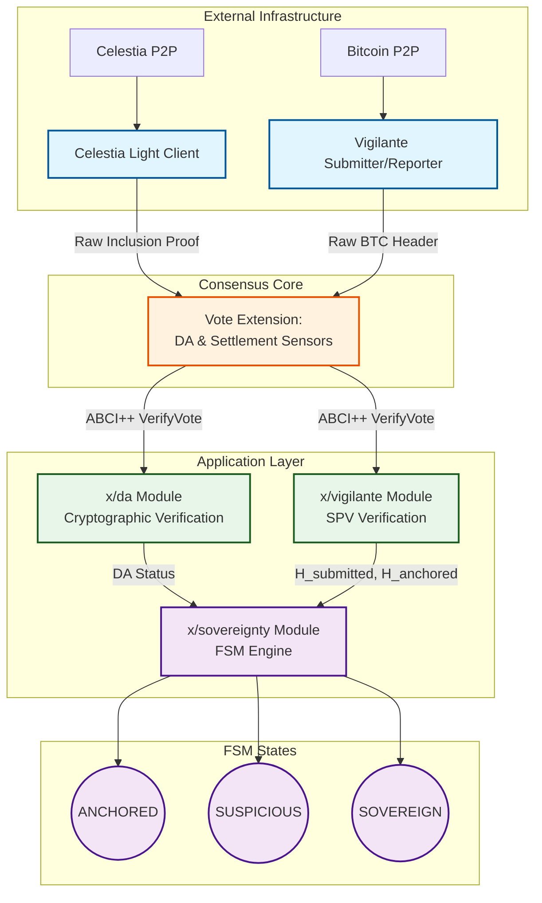
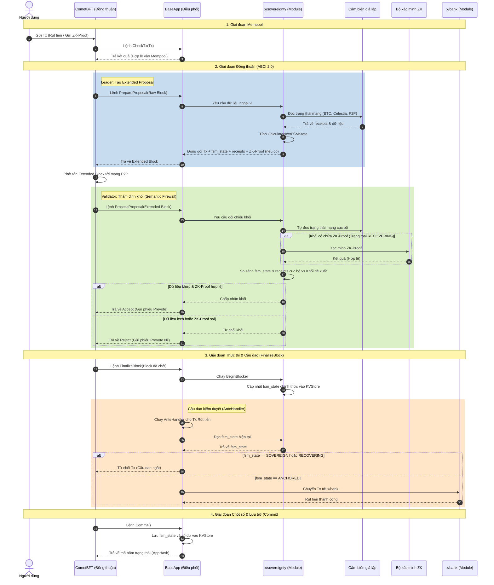

# Infrastructure Architecture

## High-Level Architecture (Mermaid Diagram)

### Validator Node Structure (Mermaid Diagram)

### IP Addressing Scheme

```
Network: 172.20.0.0/24 (engram-net) - Main Validator Network
├── Gateway: 172.20.0.1
├── Shared Services (172.20.0.10-172.20.0.30)
│   ├── Prometheus: 172.20.0.20
│   ├── Grafana: 172.20.0.21
│   └── Reserved: 172.20.0.22-172.20.0.30
└── Validators (172.20.0.100+)
    ├── Validator 0: 172.20.0.100-172.20.0.109
    ├── Validator 1: 172.20.0.110-172.20.0.119
    ├── Validator 2: 172.20.0.120-172.20.0.129
    └── Validator 3: 172.20.0.130-172.20.0.139

Network: 172.21.0.0/24 (bitcoin-net) - Bitcoin Network [ISOLATED]
├── Gateway: 172.21.0.1
├── Bitcoin Node 1: 172.21.0.10
├── Bitcoin Node 2: 172.21.0.11 (optional)
├── Validator 0 services: 172.21.0.100-172.21.0.102
├── Validator 1 services: 172.21.0.110-172.21.0.112
├── Validator 2 services: 172.21.0.120-172.21.0.122
└── Validator 3 services: 172.21.0.130-172.21.0.132

Network: 172.22.0.0/24 (celestia-net) - Celestia DA Layer [ISOLATED]
├── Gateway: 172.22.0.1
├── celestia-app: 172.22.0.10
├── celestia-light-0: 172.22.0.100
├── celestia-light-1: 172.22.0.101
├── celestia-light-2: 172.22.0.102
└── celestia-light-3: 172.22.0.103
```

### Port Allocation

Each validator uses offset ports to avoid conflicts:

```
Validator 0:  (engram-validator-node01.yml)
├── Stratium RPC:      26657  (exposed)
├── Cosmos REST API:   1317   (exposed)
├── Prometheus:        26660  (exposed)
└── Celestia Light RPC: 26658 (exposed)

Validator 1:  (engram-validator-node02.yml)  [Offset +100]
├── Stratium RPC:      26757  (exposed)
├── Cosmos REST API:   1417   (exposed)
├── Prometheus:        26760  (exposed)
└── Celestia Light RPC: 26758 (exposed)

Validator 2:  (engram-validator-node03.yml)  [Offset +200]
├── Stratium RPC:      26857  (exposed)
├── Cosmos REST API:   1517   (exposed)
├── Prometheus:        26860  (exposed)
└── Celestia Light RPC: 26759 (exposed)

Validator 3:  (engram-validator-node04.yml)  [Offset +300]
├── Stratium RPC:      26957  (exposed)
├── Cosmos REST API:   1617   (exposed)
├── Prometheus:        26960  (exposed)
└── Celestia Light RPC: 26760 (exposed)

Bitcoin Network (isolated, not exposed):
├── bitcoin-node-01 RPC: 18443
├── ZMQ Raw Block:       28332
└── ZMQ Raw Tx:          28333
```


## Draft Proposal

Here is the concise summary of the Engram Protocol's modular architecture and Finite State Machine (FSM) design, written in professional English without icons.

# Engram Protocol: Sovereign FSM and Modular Architecture

## 1. The Tripartite Sensor Architecture
To achieve external state objectivity without cluttering the consensus engine, Engram divides its sensing mechanisms into three distinct layers:

* **External Infrastructure (Docker Containers):** The `celestia-light-client` and `vigilante-reporter` act as network interfaces. They perform Data Availability Sampling (DAS) and query Bitcoin RPCs to fetch raw cryptographic proofs. They do not compute blockchain logic.
* **Application Layer (`x/` Modules):** The `x/da` and `x/vigilante` modules act as cryptographic validators. They receive raw proofs, verify Ed25519 signatures, Merkle paths, and Bitcoin SPV proofs. They guarantee mathematical correctness and update the internal KVStore.
* **Consensus Core (Sensors via ABCI++):** The DA Sensor and Settlement Sensor are embedded directly into the custom CometBFT core. They enforce that no block is voted upon unless it contains valid external proofs, blocking malicious data before the consensus phase begins.

## 2. ABCI++ Vote Extensions Integration
The system achieves consensus on external events (Time-Mismatch resolution) using ABCI++ Vote Extensions:
* **ExtendVote:** Before sending a Pre-commit, each validator queries the external containers and attaches the latest valid DA Proof and Bitcoin Proof to their vote payload.
* **VerifyVoteExtension:** Upon receiving a vote, validators route the payload to `x/da` and `x/vigilante` for cryptographic verification. Invalid proofs result in immediate vote rejection.
* **PrepareProposal:** The block proposer aggregates these validated extensions, establishing a globally agreed-upon `H_anchored` and `H_submitted` for the entire network.

## Architecture Flow Diagram




