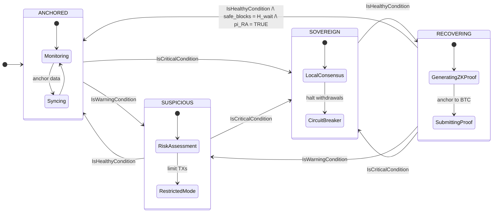
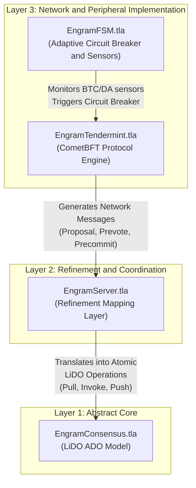
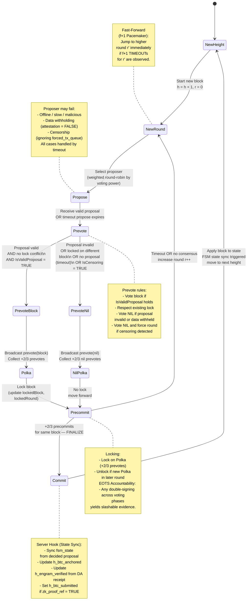

# Formal Specification and Verification of the Engram Hybrid Adaptive Consensus: FSM with Sovereign Fallback

## Abstract

This document presents the formal specification and model-checked verification of the **Hybrid Adaptive Consensus** protocol for the Engram modular blockchain. The core research question is: **Can a blockchain that depends on external settlement (Bitcoin) and data availability (Celestia) layers maintain provable Safety and Liveness even when those layers fail?**

We answer affirmatively. The protocol introduces a Finite State Machine (FSM) that autonomously degrades security level — rather than halting — when external dependencies become unavailable. **Critically, the consensus mechanism is extended beyond classical transaction ordering: validators now reach Byzantine-fault-tolerant agreement on both the application state and the health status of the peripheral network layers, treating the FSM state as a first-class consensus variable.**

All safety invariants and liveness properties are formally verified using the TLC model checker against a state space of **37.7 million states** (safety, 1h 40min) and **1.1 million states** (liveness, 6m 52s), with zero errors found.


## 1. Problem Statement

### 1.1 Structural Liveness Risk in Modular Blockchains

Modular blockchain architectures achieve scalability by separating the functions of a monolithic chain into independent, specialized layers. In the Engram architecture these layers are:

- **Execution Layer**: The Engram App-Chain, running CometBFT consensus with sub-two-second block times.
- **Data Availability (DA) Layer**: Celestia, ensuring transaction data is published and retrievable before state transitions are accepted.
- **Settlement Layer**: Bitcoin, accessed via Babylon, providing thermodynamic finality through Proof-of-Work checkpointing.

This separation introduces a dependency graph: the Execution Layer requires the DA Layer to confirm data availability before finalizing blocks, and requires the Settlement Layer to anchor checkpoints for long-range attack resistance. If either dependency becomes degraded or unreachable, a naive implementation has no recourse and halts entirely.

Concrete failure scenarios include:

- Bitcoin network congestion causes checkpoint finality to fall hours behind, triggering a liveness violation in the fork-choice rule.
- A Celestia network partition causes Data Availability Sampling (DAS) to fail, making the DA receipt unavailable.
- Simultaneous loss of both the Settlement and DA layers.

In all of these scenarios, an unmodified CometBFT engine would deadlock indefinitely because its block validity rule depends on an external precondition that is no longer satisfiable.

### 1.2 The Missing Dimension: Peripheral Network Health in Consensus

**Standard Byzantine Fault-Tolerant (BFT) consensus** protocols are concerned exclusively with **agreement on transaction ordering**. A valid block is one that contains well-formed transactions signed by a correct proposer at the right round. There is no native mechanism to represent or agree upon the operational health of the infrastructure that the chain depends upon.

This creates a second gap: **even if nodes could individually detect that the Bitcoin finality gap has grown past a threshold, they would not reach a consistent, forkless view of what the system should do about it. Different nodes observing slightly different sensor readings could make different decisions, breaking consensus.**

The **Engram Hybrid Adaptive Consensus** addresses both gaps simultaneously. Each consensus proposal carries the current FSM state, a DA receipt, and a Bitcoin anchor height as first-class fields. Validators only accept proposals whose embedded FSM state is consistent with their local sensor readings. The result is **Byzantine-fault-tolerant agreement on peripheral network health**, not only on transactions.


## 2. Proposed Solution: Hybrid Adaptive Consensus with Sovereign Fallback

### 2.1 Core Idea

The protocol maintains a four-state FSM that degrades gracefully across security levels. Instead of halting when external dependencies fail, the network:

1. **Detects degradation** through deterministic local network sensors (e.g., integrated Bitcoin SPV, Celestia DAS).
2. **Proposes a local view** of the peripheral environment, embedding the leader's observed FSM state, DA receipt, and Bitcoin anchor height directly into the current block proposal.
3. **Reaches a 2/3-quorum agreement** on this external state telemetry atomically alongside the transaction payload.
4. **Applies the appropriate security policy** (circuit breaker, withdrawal lock, fork-choice rule) based on the globally agreed-upon state.
5. **Recovers autonomously** when peripheral layers are restored, re-anchoring sovereign blocks to Bitcoin via a single recursive ZK-Proof.

Critically, the consensus object is extended: a valid proposal is no longer merely a transaction batch; it is a tuple `[transactions, fsm_state, da_receipt, btc_anchored, zk_proof_ref]`. A validator will only issue a `Prevote` for a proposal if all peripheral components strictly match its own local sensor readings, effectively establishing Byzantine-fault-tolerant agreement on the health of the entire modular stack.

### 2.2 FSM States

| State | Incident Phase | Security Basis | Withdrawals | Throughput | Finality |
|---|---|---|---|---|---|
| ANCHORED | Normal | Bitcoin + Celestia DA | Permitted | Full | ~10-60 min |
| SUSPICIOUS | Early warning | Bitcoin (degraded) | Permitted | Restricted | Moderate |
| SOVEREIGN | Active partition | Local PoS | Locked | Full | ~2 sec |
| RECOVERING | Resolution | Local PoS + pending proof | Locked | Full | ~2 sec |

### 2.3 Key Design Properties

- **Graceful degradation.** Security level decreases monotonically under failure rather than the system halting. Data already written to the chain remains protected.

- **Self-aware consensus.** The FSM transition is not an out-of-band governance action; it is agreed upon within the standard Tendermint consensus pipeline. The FSM state is embedded in each proposal and validated by every prevoting node.

- **Hysteresis.** Recovery from `SOVEREIGN` back to `ANCHORED` requires a sustained healthy period of `HYSTERESIS_WAIT` consecutive blocks and a valid ZK-Proof. This prevents state oscillation ("flapping") caused by intermittent connectivity.

- **ZK-based re-anchoring.** Blocks produced in SOVEREIGN mode are secured by local PoS. When connectivity is restored, a single recursive SNARK aggregates all sovereign transitions into one proof, allowing O(1) verification. No re-execution of sovereign blocks is required.

- **Economic circuit breaker.** Cross-chain withdrawals are locked when the state is `SOVEREIGN` or `RECOVERING`, preventing fund extraction during periods when Bitcoin finality is not available to protect against reversion.

### 2.4 FSM State Diagram




## 3. Methodology: Formal Verification via Refinement Mapping

### 3.1 The Gap in Existing Verification Frameworks

Historically, formally verifying the Liveness of Byzantine Fault-Tolerant (BFT) consensus protocols under partial synchrony has been a formidable challenge. While traditional model checkers excel at proving Safety, they fundamentally struggle with Liveness properties that require reasoning over infinite, continuous time traces. Consequently, most liveness proofs rely on informal, unmechanized arguments based on the Global Stabilization Time (GST).

This superficial approach is inadequate for the stringent security requirements of the Engram architecture. We must address three core challenges:

- **Full Lifecycle Liveness:** Engram's consensus must transition through complex Finite State Machine (FSM) states (e.g., `SOVEREIGN` to `ANCHORED`). We require mathematical guarantees that the system will never deadlock while awaiting strict preconditions (network health, ZK-Proof validity).

- **Hybrid Deadlock Freedom:** Engram runs two interacting state machines concurrently (the Tendermint consensus core and the Sovereign Fallback FSM). Verifying their integration requires a robust, compositional refinement technique.

- **Temporal Model Checking:** Standard invariant-based tools cannot automatically resolve infinite temporal properties without an abstraction that translates continuous time into finite, verifiable segments

### 3.2 The LiDO Framework: Reducing Liveness to Safety

To bridge this methodological gap, this project adopts the LiDO (Linearizable Byzantine Distributed Objects) framework ([Lefort et al., PODC 2024](https://dl.acm.org/doi/epdf/10.1145/3656423)) as the mathematical baseline. LiDO overcomes the liveness bottleneck through a paradigm shift: **reducing Liveness to Safety via Segmented Traces.** 

Instead of modeling infinite continuous time, LiDO discretizes time into finite segments of length $\Delta$ (the maximum network delay). Under partial synchrony, this guarantees that messages sent by a correct node in segment $\tau_i$ are definitively delivered by segment $\tau_{i+1}$. This mathematical trick constrains infinite temporal properties into discrete, verifiable step-by-step safety checks.

At its core, LiDO defines consensus via an Abstract Pacemaker (`round`, `rem_time`) and three atomic operations

- **Pull**: A leader election establishing an Election Quorum Certificate (`E_QC`). 
- **Invoke**: Proposing a method (transaction batch), establishing a Method Quorum Certificate (`M_QC`). 
- **Push**: Committing the method, advancing logical clocks, and establishing a Commit Quorum Certificate (`C_QC`).

#### Mechanized Verification via Refinement Mapping

A refinement mapping mathematically proves that a complex concrete system correctly implements a simpler abstract specification. If the abstract model guarantees a property $P$, the concrete implementation automatically inherits $P$.

In our architecture, `EngramServer.tla` serves as the shared-memory refinement bridge. It intercepts raw Tendermint consensus events and continuously constructs the abstract LiDO certificate tree. Through our refinement variables (`mapped_tree`, `mapped_fsm_state`, `mapped_local_times`), the TLC model checker directly verifies `AbstractConsensus!Safety` and `AbstractConsensus!Liveness`, allowing Engram to mechanically inherit LiDO's rigorous theorems for the entire hybrid protocol.


### 3.3 Layered Specification Architecture

The specification is organized into four layers following the refinement hierarchy:



- **Layer 1 — The Abstract Core (`EngramConsensus.tla`):** The mathematical LiDO specification. It defines the abstract buffer tree of quorum certificates (ADO-B), the fork-choice rule (`canElect`), the K-Deep finality rule for `ANCHORED` mode, and the maximum-stake-branch rule for `SOVEREIGN` mode. Safety and Liveness are established at this highly abstract level.

- **Layer 2 — The Refinement Bridge (`EngramServer.tla`):** The shared-memory integration layer. It utilizes four server hooks to intercept concrete Tendermint network events and atomically translate them into abstract LiDO operations:
  - `Server_InsertProposal` $\rightarrow$ **Pull** (`E_QC` creation)
  - `Server_ProposerVotes` $\rightarrow$ **Invoke** (`M_QC` creation)
  - `Server_UponProposalInPrecommitNoDecision` $\rightarrow$ **Push** (`C_QC` creation & FSM state sync)
  - `Server_UponTimeoutCert` $\rightarrow$ Timeout (`T_QC` creation)

- **Layer 3 — The Concrete Implementations:**
  - **`EngramTendermint.tla` (Protocol Engine)**: The customized CometBFT consensus engine managing the full Propose $\rightarrow$ Prevote $\rightarrow$ Precommit $\rightarrow$ Commit pipeline. It processes the extended proposal structure, simulates Byzantine attacks (data withholding, censorship, timeout flooding), and implements the improved $f+1$ pacemaker (UponfPlusOneTimeoutsAny).
  - **`EngramFSM.tla` (Sovereign Fallback):** The adaptive circuit breaker. It continuously computes `IsWarningCondition`, `IsCriticalCondition`, and `IsHealthyCondition` from peripheral sensor readings. It also manages the hysteresis counter (`safe_blocks`) and ZK-Proof validity flag (`reanchoring_proof_valid`).


## 4. Network Sensors: Measuring Peripheral Layer Health

The FSM requires deterministic, on-chain measurements of peripheral layer health. Three sensor categories are continuously evaluated. Sensor values are embedded in each consensus proposal and agreed upon by quorum, ensuring all correct nodes operate on a consistent view of network health.

### 4.1 Bitcoin Finality Gap Sensor

This sensor measures how far the latest Engram epoch checkpoint is from being Bitcoin-confirmed. A growing gap indicates Bitcoin congestion, or a liveness attack on the checkpointing system. Referring to the [Vigilante Checkpointing Monitor](https://docs.babylonlabs.io/guides/overview/babylon_genesis/architecture/vigilantes/monitor/), the Finality Gap Sensor formula is simplified as follows:

$$\Delta H_{\text{BTC}} = H_{\text{current}} - \min(H_{\text{submitted}},\, H_{\text{anchored}})$$

- $H_{\text{current}}$: latest Bitcoin block height observed by Engram validator nodes running an SPV light client.
- $H_{\text{submitted}}$: Bitcoin block height at the moment an Engram epoch checkpoint was broadcast.
- $H_{\text{anchored}}$: Bitcoin block height at which the checkpoint was confirmed (included in the Bitcoin chain).

The formula uses $\min(H_{\text{submitted}}, H_{\text{anchored}})$ as the baseline so that a submitted-but-unconfirmed checkpoint is counted toward the gap.

### 4.2 Data Availability Gap Sensor

This sensor measures the lag between the current Engram chain head and the last block for which a verified DA commitment receipt has been received from Celestia via Blobstream.

$$\Delta H_{\text{DA}} = H_{\text{local}} - H_{\text{verified}}$$

- $H_{\text{local}}$: current Engram-app chain block height.
- $H_{\text{verified}}$: highest Engram block height for which a valid DA commitment attestation has been received.

#### Data Availability Sampling (DAS)

Each Engram validator node, acting as a Celestia light client, performs $N = 15$ random sampling checks per block. This is sufficient to confirm data availability with probability greater than 99%.

Let $s_i \in \{\text{TRUE}, \text{FALSE}\}$ denote the outcome of the $i$-th sample:

$$\text{IsAvailable}(B) \triangleq \bigwedge_{i=1}^{N} s_i \qquad \text{Failed}(B) \triangleq \exists\, i \in \{1, \dots, N\} \text{s.t.} \neg s_i$$

The boolean `is_das_failed` is set to TRUE if any sampling check fails within the current epoch.

### 4.3 P2P Health Sensor

> Detailed Development Specification (in-progress)

The number of active peer connections, `peer_count`, is monitored continuously. The requirement $P \geq P_{\min}$ as a precondition for the healthy state prevents an isolated node from triggering recovery based on a stale or adversarial sensor view.


## 5. State Transition Conditions

Sensor values are composed into three composite conditions that drive state machine transitions. Sensors only **propose** a state; the actual FSM state the network operates in is determined by the consensus pipeline. A proposer embeds the target FSM state in its proposal, and validators prevote for it only if it is consistent with their own local sensor readings. This ensures that all correct nodes remain on the same FSM state without requiring a separate out-of-band coordination step.

Let $P$ denote `peer_count` and $P_{\min}$ denote `MIN_PEERS`.

### Warning Condition

Indicates that one or more peripheral layers are operating outside normal parameters, but the situation is not yet critical. Triggers a transition toward degraded states.

$$ 
\begin{aligned}
\text{IsWarningCondition} \triangleq\;&
(T_\text{Suspicious} \leq \Delta H_\text{BTC} < T_\text{Sovereign}) \\
&\lor (\Delta H_\text{DA} \geq T_\text{DA}) \\
&\lor \text{IsDASFailed} \\
&\lor (P < P_{min})
\end{aligned}
$$ 

### Critical Condition

Indicates that Bitcoin settlement finality has been unavailable beyond the tolerance threshold. Triggers the circuit breaker.

$$\text{IsCriticalCondition} \triangleq \Delta H_{\text{BTC}} \geq T_{\text{Sovereign}}$$

### Healthy Condition

All peripheral layers are operating within normal parameters. Required as a precondition for initiating or progressing through recovery.


$$ 
\begin{aligned}
\text{IsHealthyCondition} \triangleq\;&
\Delta H_\text{BTC} < T_\text{Suspicious} \\
&\land \Delta H_\text{DA} < T_\text{DA} \\
&\land \lnot \text{IsDASFailed} \\
&\land P \geq P_\text{min}
\end{aligned}
$$


The $P \geq P_{\min}$ requirement is an Eclipse Attack defense: an isolated node must not be able to declare the network healthy and unilaterally trigger recovery when the honest majority is unreachable.


## 6. State Transition Logic

> **Note for future revision.** The transition definitions below represent the current formal specification. The interactions between RECOVERING and concurrent network partitions (RecoveringToSuspicious, RecoveringToSovereign) are acknowledged as candidates for refinement as the protocol matures. These transitions are isolated in Section 6.1 to make future adjustments straightforward.

All transitions require greater than 2/3 quorum agreement through the consensus pipeline before taking effect.

### 6.1 Transition Definitions

The transitions are grouped by source state for clarity. Each transition definition is expressed as a TLA+ predicate over the current system state.

**From ANCHORED:**

$$
\begin{aligned}
\text{AnchoredToSuspicious} \triangleq\;& state = \text{ANCHORED} \\
&\land \text{IsWarningCondition} \\
&\land \lnot \text{IsCriticalCondition}
\end{aligned}
$$


$$
\begin{aligned}
\text{AnchoredToSovereign} \triangleq\;& state = \text{ANCHORED} \\
&\land \text{IsCriticalCondition}
\end{aligned}
$$

**From SUSPICIOUS:**

$$
\begin{aligned}
\text{SuspiciousToAnchored} \triangleq\;& state = \text{SUSPICIOUS} \\
&\land \text{IsHealthyCondition}
\end{aligned}
$$

$$
\begin{aligned}
\text{SuspiciousToSovereign} \triangleq\;& state = \text{SUSPICIOUS} \\
&\land \text{IsCriticalCondition}
\end{aligned}
$$

**From SOVEREIGN:**

$$
\begin{aligned}
\text{SovereignToRecovering} \triangleq\;& state = \text{SOVEREIGN} \\
&\land \text{IsHealthyCondition}
\end{aligned}
$$

**From RECOVERING** (candidates for future refinement are marked):

$$
\begin{aligned}
\text{RecoveringProgress} \triangleq\;& state = \text{RECOVERING} \\
&\land \text{IsHealthyCondition} \\
&\land safe\_blocks < \text{HysteresisWait}
\end{aligned}
$$

$$
\begin{aligned}
\text{RecoveringToAnchored} \triangleq\;& state = \text{RECOVERING} \\
&\land \text{IsHealthyCondition} \\
&\land safe\_blocks = \text{HysteresisWait} \\
&\land reanchoring\_proof\_valid = \text{TRUE}
\end{aligned}
$$

$$
\begin{aligned}
\text{RecoveringToSuspicious} \triangleq\;& state = \text{RECOVERING} \\
&\land \text{IsWarningCondition} \\
&\land \lnot \text{IsCriticalCondition}
\end{aligned}
$$

$$
\begin{aligned}
\text{RecoveringToSovereign} \triangleq\;& state = \text{RECOVERING} \\
&\land \text{IsCriticalCondition}
\end{aligned}
$$

### 6.2 Re-anchoring via Recursive ZK-Proof

Blocks produced in `SOVEREIGN` mode are secured only by local PoS and are not yet Bitcoin-anchored. To restore Bitcoin-grade finality, these blocks must be reconciled with the Bitcoin-anchored history without requiring re-execution of each sovereign block individually.

Let $S_{\text{last}}$ be the last Bitcoin-anchored state and $\Delta_1, \dots, \Delta_n$ be the sequence of sovereign state transitions. The re-anchoring proof $\pi_{\text{RA}}$ must satisfy:

$$V(S_{\text{last}}, S_{\text{new}}, \pi_{\text{RA}}) = 1, \quad\text{where} S_{\text{new}} = S_{\text{last}} + \sum_{i=1}^{n} \Delta_i$$

A single recursive SNARK (Plonk proving system, Poseidon2 hash) aggregates all sovereign transitions into one constant-size proof, allowing $O(1)$ verification on the settlement layer regardless of the number of sovereign blocks produced.

### 6.3 Hysteresis Mechanism

The `safe_blocks` counter prevents state oscillation. On entry into RECOVERING, the counter is reset to zero. Each block for which `IsHealthyCondition` holds increments the counter by one. The transition to ANCHORED is blocked until `safe_blocks = HYSTERESIS_WAIT`. Any deterioration resets the counter to zero and the process restarts.


## 7. Consensus Protocol: Hybrid Adaptive Tendermint with Extended Proposal

The base consensus engine is CometBFT (Tendermint). The key extension is the **Proposal structure**, which carries additional fields required by the hybrid model:

```
Proposal := {
    value        : transaction batch (TX_NORMAL | TX_WITHDRAWAL),
    timestamp    : local clock at proposal time,
    round        : current consensus round,
    fsm_state    : agreed FSM state embedded in proposal,
    da_receipt   : { blockHeight : Nat, attestation : Bool },
    btc_anchored : Bitcoin anchor height at proposal time,
    zk_proof_ref : Bool  (proof submission flag for re-anchoring)
}
```

A validator accepts a proposal and casts a PREVOTE only if `IsValidProposal(proposal)` holds. This predicate enforces:
- The embedded `fsm_state` matches the validator's local state.
- The DA receipt is valid and within the allowed DA gap (required for `ANCHORED` and `RECOVERING` states).
- `btc_anchored` is monotonically non-decreasing (settlement safety).
- Withdrawal transactions are blocked when `fsm_state = SOVEREIGN`.
- A ZK-Proof is mandatory when `fsm_state = RECOVERING` and `safe_blocks = HYSTERESIS_WAIT`.




## 8. Security and Safety Analysis

The formal correctness of the hybrid consensus protocol is guaranteed across the entire reachable state space. The network is modeled against a Byzantine adversary controlling up to $f$ nodes out of $n = 3f + 1$ total, with adversarial message scheduling and non-deterministic peripheral sensor readings.

**Theorem 8.1 (Hybrid Consensus Safety and Accountability).** *Under partial synchrony, no two honest nodes will ever decide on conflicting blocks or conflicting FSM states. Any safety violation mathematically guarantees the extraction of cryptographic double-signing evidence via EOTS.*

$$\forall\, p, q \in \text{Corr}: \bigl(decision[p] \neq \bot \land decision[q] \neq \bot\bigr) \implies decision[p].value = decision[q].value$$

### 8.1 State Invariants

To prove Theorem 8.1, the TLC model checker exhaustively verified the following invariants against 37.7 million reachable states with zero violations.

**Invariant S1 (Circuit Breaker Isolation).** Cross-chain withdrawals are strictly locked if and only if the protocol operates in a fallback state. This prevents fund extraction during any period when Bitcoin finality cannot guarantee the irreversibility of cross-chain transactions.

$$\text{withdrawLocked} \iff state \in \{\text{SOVEREIGN},\, \text{RECOVERING}\}$$

Formally specified in `EngramFSM.tla` as `CircuitBreakerSafety` and verified as `CircuitBreakerSafety` in both model checker configurations.

**Invariant S2 (Hysteresis Integrity).** A transition from `RECOVERING` back to `ANCHORED` is impossible without satisfying the full hysteresis wait period and providing a valid recursive ZK-Proof. This prevents premature re-anchoring during intermittent connectivity.

$$\square\Bigl[\bigl(state = \text{RECOVERING} \land state' = \text{ANCHORED}\bigr) \implies \bigl(safeBlocks = H_{\text{wait}} \land \pi_{\text{RA}} = \text{TRUE}\bigr)\Bigr]$$

Formally specified in `EngramFSM.tla` as `HysteresisSafety` and verified as a temporal safety property in `MC_ServerRefinementSafety`.

**Invariant S3 (FSM State Consistency).** Every decided proposal must carry the same FSM state that the network is currently operating in. This closes the gap identified in Section 1.2: no node can commit a block claiming a different security posture than the one the honest majority agreed upon.

$$\forall\, p \in \text{Corr}: decision[p] \neq \bot \implies decision[p].prop.fsmState = state$$

Formally specified in `EngramServer.tla` as `FSMStateConsistency`, part of `HybridTendermintInv`.

### 8.2 Attack Resilience Lemmas

Beyond the state invariants, the `IsValidProposal` predicate in `EngramTendermint.tla` serves as a semantic firewall that enforces the following attack-specific lemmas at the consensus layer.

**Lemma 8.2 (Data Withholding Resistance).** Block validity strictly requires a Data Availability attestation for all proposals in `ANCHORED` or `RECOVERING` states. A Byzantine leader that publishes a block header while withholding the transaction body (`attestation = FALSE`) will have its proposal rejected by all honest validators, who will cast PREVOTE NIL and force a round change.

$$\bigl(state \in \{\text{ANCHORED},\, \text{RECOVERING}\}\bigr) \implies daReceipt.attestation = \text{TRUE}$$

The `Byzantine_Data_Withholding` action in `EngramTendermint.tla` explicitly injects such malformed proposals into the state space. `DAReceiptConsistency` in `HybridTendermintInv` formally captures the invariant that no such proposal is ever decided.

**Lemma 8.3 (Long-Range Attack Prevention).** The fork-choice rule enforces strict monotonic settlement anchoring. Any adversarial proposal attempting to revert to a prior Bitcoin anchor height is automatically rejected, rendering historical rewrites economically irrational without reorganizing the Bitcoin Proof-of-Work chain itself.

$$btcAnchored(B_\text{i+1}) \geq btcAnchored(B_i)$$

Formally specified as the settlement monotonicity check in `IsValidProposal` (`prop.btc_anchored >= h_btc_anchored`) and captured by `BTCConsistency` in `HybridTendermintInv`.

**Lemma 8.4 (Byzantine Message Flooding Mitigation).** The set of adversarial messages injected into the state space per round and per message type is deterministically bounded by the size of the Byzantine coalition. This is enforced structurally by the initial message sets `FaultyPrevotes(r)`, `FaultyPrecommits(r)`, and `FaultyTimeouts(r)` in `EngramTendermint.tla`, each of which generates exactly $|F|$ messages.

$$|\text{messages}(t,\, r,\, F)| \leq |F|$$

**Lemma 8.5 (Eclipse Attack Resilience).** The `IsHealthyCondition` predicate mandates a minimum peer connectivity bound as a precondition for any recovery-initiating transition. An isolated node that cannot observe $P_{\min}$ active peers is prevented from declaring the network healthy and unilaterally triggering recovery, even if all its other sensor readings appear normal.

$$\text{IsHealthyCondition} \implies peer\_count \geq P_{\min}$$

> *Remark:* The full formal scenario modeling how an eclipsed leader's fabricated `fsm_state` is deterministically rejected by the honest majority via `FSMStateConsistency` is under partial specification. The conjecture is that `IsValidProposal` in combination with `FSMStateConsistency` is sufficient; a dedicated TLC scenario confirming this is planned for a future revision (see Section 11.2).

**Lemma 8.6 (EOTS Accountability).** Any fork — i.e., any violation of `AgreementOnValue` — mathematically implies that some node broadcast two conflicting messages in the same round. The `DoubleSigningEvidence` predicate detects this across Propose, Prevote, and Precommit phases. Once detected, Extractable One-Time Signature (EOTS) properties allow the offending validator's private key to be extracted and their staked BTC to be slashed without requiring smart contract execution on Bitcoin.

$$\neg\text{AgreementOnValue} \implies \text{DoubleSigningEvidence}$$

Formally specified in `EngramTendermint.tla` as `Accountability`, part of `CoreTendermintInv`.


## 9. Liveness Analysis and Autonomous Recovery

Modular blockchains face critical liveness risks when peripheral layers fail. Through the refinement mapping in `EngramServer.tla`, the concrete implementation mechanically inherits the abstract liveness properties of the LiDO framework. The following theorem is verified across 1.1 million states.

**Theorem 9.1 (Autonomous Liveness under Degradation).** *The protocol continually processes transactions under normal conditions and autonomously degrades, recovers, and re-anchors its security posture without permanent stalling, even during external modular layer failures.*

### 9.1 FSM Temporal Properties

Theorem 9.1 is established by verifying the following temporal leads-to properties under weak fairness assumptions, using TLC's implied-temporal checking across 8 branches.

**Property L1 (Standard Consensus Liveness).** Under normal partial synchrony — specifically, whenever the Global Stabilization Time condition is repeatedly reached — honest validators always eventually commit a new block. The condition `GST_Reached` in `EngramServer.tla` requires synchronized clocks, sufficient peers, and `state = ANCHORED`.

$$(\square\lozenge \text{GSTReached}) \leadsto \bigl(\exists\, p \in \text{Corr}: step[p] = \text{"DECIDED"}\bigr)$$

Formally specified as `EventualDecisionUnderGST` in `EngramServer.tla`.

**Property L2 (Circuit Breaker Liveness).** When a critical condition is detected by the honest majority, the network must eventually reach the `SOVEREIGN` state. This is guaranteed by the improved $f+1$ pacemaker (`UponfPlusOneTimeoutsAny`): if $f+1$ honest nodes have timed out and advanced to a higher round, all lagging nodes fast-forward accordingly. Combined with weak fairness on `AnchoredToSovereign` and `SuspiciousToSovereign`, the circuit breaker is guaranteed to eventually activate.

$$\text{IsCriticalCondition} \leadsto \bigl(state = \text{SOVEREIGN} \lor \lnot\text{IsCriticalCondition}\bigr)$$

Formally specified as `CircuitBreakerLiveness` in `EngramFSM.tla`, part of `ServerFSMLiveness`.

**Property L3 (Autonomous Recovery Initiation).** When the network is operating in `SOVEREIGN` state and peripheral layers have fully recovered, the system must eventually initiate the recovery sequence. This holds because `IsHealthyCondition` requires $P \geq P_{\min}$ active peers, guaranteeing that a quorum of honest nodes is connected and able to agree on `SovereignToRecovering`.

$$\bigl(state = \text{SOVEREIGN} \land \text{IsHealthyCondition}\bigr) \leadsto \bigl(state = \text{RECOVERING} \lor \lnot\text{IsHealthyCondition}\bigr)$$

Formally specified as `RecoveryAttemptLiveness` in `EngramFSM.tla`, part of `ServerFSMLiveness`.

**Property L4 (Complete Re-anchoring).** Once a valid ZK-Proof is available and network conditions remain healthy throughout the hysteresis wait, the system must eventually return to `ANCHORED`. Under these conditions, `RecoveringToAnchored` is the only enabled FSM transition, and weak fairness guarantees it will eventually fire.

$$\bigl(state = \text{RECOVERING} \land \pi_{\text{RA}} = \text{TRUE} \land \text{IsHealthyCondition}\bigr) \leadsto \bigl(state = \text{ANCHORED} \lor \lnot\text{IsHealthyCondition} \lor \pi_{\text{RA}} \neq \text{TRUE}\bigr)$$

Formally specified as `CompleteRecoveryLiveness` in `EngramFSM.tla`, part of `ServerFSMLiveness`.

### 9.2 Transaction-Level Liveness

**Property L5 (Active Censorship Resistance).** If a Byzantine leader systematically ignores a valid transaction in the `forced_tx_queue` for `MaxIgnoreRounds` consecutive rounds, the `IsCensoring` predicate triggers: honest validators broadcast a TIMEOUT instead of a PREVOTE, forcing a round change and eventually rotating to an honest leader who will include the transaction.

$$\forall\, tx \in \text{ValidValues}: \Bigl(\square\lozenge \bigl(tx \in \text{msgsPropose}\bigr)\Bigr) \implies \lozenge\bigl(\exists\, p \in \text{Corr}: decision[p].value = tx\bigr)$$

Formally specified as `ForcedInclusionLiveness` in `EngramServer.tla`.


## 10. Verification Results
### 10.1 Proof Strategy

The verification proceeds in two phases:

**Phase 1 — Safety.** `MC_ServerRefinementSafety` checks that the concrete `EngramServer` system — under Byzantine message scheduling, adversarial sensor readings, malicious leaders, and data withholding — never violates `AbstractConsensus!Safety`. If no counterexample is found across all reachable states, then the refinement mapping is correct for safety.

**Phase 2 — Liveness.** `MC_ServerRefinementLiveness` checks that under weak fairness conditions, `AbstractConsensus!Liveness` is satisfied. Since the concrete system refines the abstract model, Liveness at the abstract level implies Liveness at the concrete level by the refinement theorem.

The key linking invariant is `QuorumOverlap`:

$$\forall\, q_1, q_2 \in \text{ValidQuorums} : (q_1 \cap q_2) \cap \text{Corr} \neq \emptyset$$

This ensures that any two quorum decisions share at least one honest node, which is the foundation of both Agreement and Liveness in the LiDO model.

### 10.2 Model Parameters

| Parameter | Safety | Liveness | Meaning |
|---|---|---|---|
| $N$ | 4 | 4 | Total nodes |
| $T$ | 1 | 1 | Byzantine nodes |
| MaxRound | 3 | 2 | Consensus rounds explored |
| MaxBTCHeight | 3 | 2 | Bitcoin height range |
| MaxEngramHeight | 3 | 2 | Engram height range |
| T\_SUSPICIOUS | 1 | 1 | BTC gap warning threshold |
| T\_SOVEREIGN | 2 | 2 | BTC gap critical threshold |
| T\_DA | 2 | 2 | DA gap threshold |
| HYSTERESIS\_WAIT | 1 | 1 | Safe blocks for recovery |
| MIN\_PEERS | 2 | 2 | Minimum healthy peers |

### 10.3 Safety Verification

```
Command : tlc -workers 8 -config mc/server/MC_ServerRefinementSafety.cfg
                          mc/server/MC_ServerRefinementSafety.tla

Started : 2026-04-28 15:34:07
Finished: 2026-04-28 17:14:09   (1 hour 40 minutes)
Platform: Mac OS X 26.2 aarch64, 8 workers, 3641 MB heap

States generated  : 37,764,737
Distinct states   : 179,200
States on queue   : 0
Search depth      : 14
Avg. outdegree    : 1  (min 0, max 31, 95th percentile 4)

Fingerprint collision probability:
  Optimistic estimate : 3.7E-7
  Actual fingerprints : 5.0E-9

Result: Model checking completed. No error has been found.
```

Invariants verified (zero violations across all 179,200 distinct states):

| Invariant | Description |
|---|---|
| TypeInvariant | All variables remain within their declared types |
| CoreTendermintInv | Agreement, timestamp validity, external validity, accountability |
| HybridTendermintInv | FSM consistency, DA receipt consistency, BTC anchor consistency, ZK-Proof consistency |
| CircuitBreakerSafety | Withdrawals locked if state in {SOVEREIGN, RECOVERING} |

Properties verified: `HysteresisSafety`, `RefinementSafety` (AbstractConsensus!Safety).

### 10.4 Liveness Verification

```
Command : tlc -workers 8 -config mc/server/MC_ServerRefinementLiveness.cfg
                          mc/server/MC_ServerRefinementLiveness.tla

Started : 2026-04-28 16:11:14
Finished: 2026-04-28 16:18:04   (6 minutes 52 seconds)
Platform: Mac OS X 26.2 aarch64, 8 workers, 3641 MB heap

States generated  : 1,098,891
Distinct states   : 5,648
States on queue   : 0
Search depth      : 10
Avg. outdegree    : 1  (min 0, max 31, 95th percentile 4)

Fingerprint collision probability:
  Optimistic estimate : 3.3E-10
  Actual fingerprints : 2.7E-12

Result: Model checking completed. No error has been found.
```

Temporal properties verified:

| Property | Description |
|---|---|
| ServerEventualDecision | At least one correct node eventually decides |
| ServerFSMLiveness | L1 (circuit breaker), L2 (recovery attempt), L3 (complete recovery) |
| EventualDecisionUnderGST | Under repeated GST conditions, consensus always terminates |
| ForcedInclusionLiveness | Queued transactions that are continually proposed are eventually decided |
| RefinementLiveness | AbstractConsensus!Liveness |

### 10.5 Interpretation

The safety verification explores 37.7 million states to depth 14, covering all reachable combinations of Byzantine message scheduling, adversarial sensor readings (including simultaneous Bitcoin and Celestia failures), and malicious leader behavior (data withholding, censorship). Zero invariant violations were found.

The liveness verification confirms that under weak fairness all three FSM liveness properties hold across 1.1 million states to depth 10. The fingerprint collision probability of 2.7E-12 per state makes the probability of a missed violation negligible.

Together, these results constitute a machine-verified proof that the Engram hybrid protocol correctly refines the LiDO abstract model, and that the inherited LiDO Safety and Liveness theorems apply to the concrete protocol.


## 11. Future Work

### 11.1 Pipelined Tendermint (Phase Merging)

The current specification verifies an unpipelined Tendermint core. A pipelined variant targeting sub-two-second block times is planned, as documented in the TODO block of `EngramTendermint.tla`:

1. Overload the PREVOTE message at round $r$ to simultaneously act as the PRECOMMIT for round $r-1$.
2. Remove the `msgsPrecommit` mailbox.
3. Delegate block commit to the proposer of round $r+1$.
4. Update the Liveness refinement to require cooperation from two consecutive honest leaders (per LiDO Appendix D).

### 11.2 Eclipse Attack Formal Scenario

A dedicated TLA+ scenario modeling an Eclipse Attack — where a partitioned node receives false peer-count readings — should be constructed to formally verify that the $P \geq P_{\min}$ guard in `IsHealthyCondition` is both necessary and sufficient for the defense.

### 11.3 Parametric Verification

The current results use a small-scope hypothesis (4 nodes, $f = 1$). Extending the proof to arbitrary $N$ and $f$ would require inductive invariant techniques or a parametric model checker, and is left for future work.


## 12. How to Run the Verification

### Prerequisites

- Java JDK 11 or higher.
- `tla2tools.jar` from [TLA+ Releases](https://github.com/tlaplus/tlaplus/releases), placed at a known path.

### Safety Verification

```bash
cd docs/spec

java -cp /path/to/tla2tools.jar tlc2.TLC \
  -workers 8 \
  -config mc/server/MC_ServerRefinementSafety.cfg \
  mc/server/MC_ServerRefinementSafety.tla
```

Expected: approximately 100 minutes, 37.7M states generated, no error found.

### Liveness Verification

```bash
cd docs/spec

java -cp /path/to/tla2tools.jar tlc2.TLC \
  -workers 8 \
  -config mc/server/MC_ServerRefinementLiveness.cfg \
  mc/server/MC_ServerRefinementLiveness.tla
```

Expected: approximately 7 minutes, 1.1M states generated, no error found.

### Using VS Code

1. Install the TLA+ extension.
2. Open `MC_ServerRefinementSafety.tla` or `MC_ServerRefinementLiveness.tla`.
3. Open the Command Palette (`Cmd+Shift+P` on macOS, `Ctrl+Shift+P` on Linux/Windows).
4. Select `TLA+: Check model with TLC`.
5. Choose the corresponding `.cfg` file when prompted.


## Appendix: File Structure

```
docs/spec/
├── README.md
├── core/
│   ├── EngramVars.tla                           (shared variable declarations)
│   ├── EngramConsensus.tla                      (Layer 1: LiDO abstract model)
│   ├── EngramFSM.tla                            (Layer 3: adaptive FSM and sensors)
│   ├── EngramTendermint.tla                     (Layer 3: CometBFT protocol engine)
│   └── EngramServer.tla                         (Layer 2: refinement mapping)
└── mc/
    └── server/
        ├── MC_ServerRefinementSafety.tla
        ├── MC_ServerRefinementSafety.cfg
        ├── MC_ServerRefinementLiveness.tla
        └── MC_ServerRefinementLiveness.cfg
```

## References

1. Al-Bassam, M., Sonnino, A., & Buterin, V. (2019). *LazyLedger: A Distributed Data Availability Ledger with Client-Side Validation*. arXiv.  
   https://arxiv.org/abs/1905.09274

2. Buchman, E. (2016). *Tendermint: Byzantine Fault Tolerance in the Age of Blockchains* (Ph.D. Dissertation). University of Guelph.  
   https://atrium.lib.uoguelph.ca/items/6c1ad7d4-7e5c-4f7f-b3d4-3f60d4fda1f5

3. Honoré, W., Qiu, L., Kim, Y., Shin, J.-Y., Kim, J., & Shao, Z. (2024). *AdoB: Bridging Benign and Byzantine Consensus with Atomic Distributed Objects*. **Proceedings of the ACM on Programming Languages**, 8(OOPSLA1), Article 109, 1–45.  
   https://doi.org/10.1145/3649826

4. Honoré, W., Shin, J.-Y., Kim, J., & Shao, Z. (2022). *Adore: Atomic Distributed Objects with Certified Reconfiguration*. In **Proceedings of the 43rd ACM SIGPLAN International Conference on Programming Language Design and Implementation (PLDI '22)** (pp. 379–394).  
   https://doi.org/10.1145/3519939.3523444

5. Lamport, L. (2002). *Specifying Systems: The TLA+ Language and Tools for Hardware and Software Engineers*. Addison-Wesley.  
   https://lamport.azurewebsites.net/tla/book.html

6. Lefort, A., et al. (2024). *LiDO: Linearizable Byzantine Distributed Objects*. In **Proceedings of ACM PODC 2024**.  
   https://doi.org/10.1145/3656423

7. Tas, E., et al. (2022). *Babylon: Reusing Bitcoin Mining Power for Proof-of-Stake Security*. arXiv.  
   https://arxiv.org/abs/2207.08392