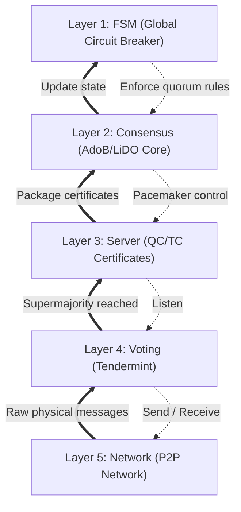
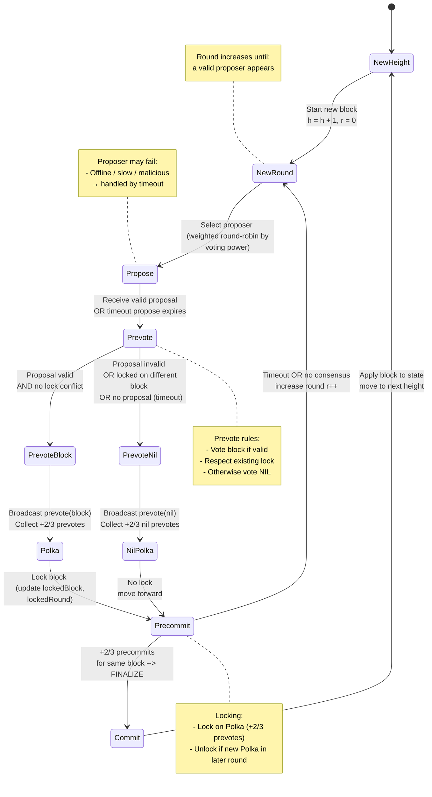

# Formal Specification of the Engram Adaptive Consensus FSM

This directory contains the formal mathematical specification of the **Adaptive Consensus Finite State Machine (FSM)** for the Engram Protocol, written in **TLA+** and verified with **TLC** to prove correctness during network partitions.

## 1. Overview
 
Engram is a modular blockchain decoupled into execution, DA (Celestia), and settlement (Bitcoin/Babylon). This architecture introduces a structural liveness risk: if any external layer becomes unavailable, a naive implementation would halt entirely. The Adaptive Consensus FSM mitigates this by autonomously switching consensus modes while preserving provable safety throughout every transition.

The FSM governs four states:
 
- **ANCHORED**: Normal operation. Bitcoin-secured via Babylon checkpointing; DA confirmed via Celestia/Blobstream.
- **SUSPICIOUS**: Early warning. Warning conditions detected — restricts high-risk transactions and prioritizes critical operations.
- **SOVEREIGN**: Active partition. Local PoS activated; Circuit Breaker halts all cross-chain withdrawals.
- **RECOVERING**: Resolution. Connectivity restored; aggregates all Sovereign transitions into a single recursive ZK-Proof to re-anchor to Bitcoin.
 
### State Comparison Summary
 
| | ANCHORED | SUSPICIOUS | SOVEREIGN | RECOVERING |
|---|---|---|---|---|
| Incident phase | Normal | Early warning | Active partition | Resolution |
| Security basis | Bitcoin | Bitcoin (degraded) | Local PoS | Local PoS + pending proof |
| Withdrawals | Permitted | Permitted | Locked | Locked |
| Throughput | Full | Restricted | Full | Full |
| Finality latency | ~10–60 mins | Moderate | ~2 Seconds | ~2 Seconds |
| Liveness | Bitcoin + Celestia | Partial | Self-sovereign | Self-sovereign |
 


## 2. System Model

We consider three scenarios of connection loss:
1. **Case 1:** Loss of connection to the Data Availability layer (Celestia) only.
2. **Case 2:** Loss of connection to the Security/Settlement layer (Bitcoin) only.
3. **Case 3:** Simultaneous loss of connection to both the Data Availability and Security/Settlement layers.

### 2.1 Observable Variables (Network Sensors)

Four continuously monitored sensor variables drive the FSM (from `VARIABLES` in `EngramFSM.tla`).

| Variable | Type | Description |
|---|---|---|
| `btc_gap` | `0..MAX_BTC_GAP` | Block height diff since last confirmed Bitcoin checkpoint |
| `da_gap` | `0..MAX_DA_GAP` | Block height diff since last verified DA commitment receipt |
| `is_das_failed` | `BOOLEAN` | True if any Data Availability Sampling check failed |
| `peer_count` | `0..MIN_PEERS * 2` | Number of active P2P peers visible |

### 2.2 Measurement Formulas for Network Sensors

#### **Bitcoin Finality Gap:** 
Referring to the monitoring formula and Liveness Attack assessment of the Bitcoin network from the [Vigilante Checkpointing Monitor](https://docs.babylonlabs.io/guides/overview/babylon_genesis/architecture/vigilantes/monitor/), the formula is simplified for the Finality Gap Sensor as follows:


$$\Delta H_\text{BTC} = H_\text{current} - \min(H_\text{submitted},\, H_\text{anchored})$$ 

* **$H_\text{current}$**: The current block height of the Bitcoin network as observed by Engram nodes.
* **$H_\text{submitted}$**: The Bitcoin block height at the exact moment an Engram epoch ends and its checkpoint is submitted.
* **$H_\text{anchored}$**: The Bitcoin block height at which the Engram checkpoint is successfully included.

#### **Data Availability Gap:**

$$\Delta H_\text{DA} = H_\text{local} - H_\text{verified}$$ 

- $H_\text{local}$: The current block height of the Engram network.  
- $H_\text{verified}$: The highest Engram block height that has received a valid Data Availability commitment (DA commitment) receipt from Celestia via Blobstream.

#### **Data Availability Sampling:**

Let $s_i \in \{\text{TRUE}, \text{FALSE}\}$ denote the outcome of the $i$-th sampling check across $N$ samples.

- Availability confirmed:

$$
\text{IsAvailable}(B) \triangleq \bigwedge_{i=1}^{N} s_i
$$

- Failure detected:

$$
\text{Failed}(B) \triangleq \exists i \in \{1, \dots, N\} \;\text{s.t.}\; \neg s_i
$$

> **IMPORTANT NOTE:** Each Engram validator node (Celestia light client) performs 15 samples per block, sufficient to confirm with greater than 99% probability that the full block data is published.

### 2.3 State Transition Conditions

Let $P$ = `peer_count` and $P_\text{min}$ = `MIN_PEERS`. Three composite conditions drive state transitions:

- **Warning condition** (triggers ANCHORED to SUSPICIOUS):

 $$ 
 \begin{aligned}
 \text{IsWarningCondition} \triangleq\;&
 (T_\text{Suspicious} \leq \Delta H_\text{BTC} < T_\text{Sovereign}) \\
 &\lor (\Delta H_\text{DA} \geq T_\text{DA}) \\
 &\lor \text{IsDASFailed} \\
 &\lor (P < P_{min})
 \end{aligned}
 $$ 


- **Critical condition** (triggers SOVEREIGN):

$$\text{IsCriticalCondition} \triangleq \Delta H_\text{BTC} \geq T_\text{Sovereign}$$ 

- **Healthy condition** (prerequisite for recovery):

 $$ 
 \begin{aligned}
 \text{IsHealthyCondition} \triangleq\;&
 \Delta H_\text{BTC} < T_\text{Suspicious} \\
 &\land \Delta H_\text{DA} < T_\text{DA} \\
 &\land \lnot \text{IsDASFailed} \\
 &\land P \geq P_\text{min}
 \end{aligned}
 $$ 

 > $P \geq P_\text{min}$ prevents isolated nodes from triggering recovery (Eclipse Attack defense).


## 3. State Transitions

> **IMPORTANT NOTE:** All state transitions must achieve consensus from > 2/3 of the nodes in the network. 

### 3.1 Transition Definitions

- **ANCHORED to SUSPICIOUS**:

$$
\begin{aligned}
\text{AnchoredToSuspicious} \triangleq\;& state = \text{ANCHORED} \\
&\land \text{IsWarningCondition} \\
&\land \lnot \text{IsCriticalCondition}
\end{aligned}
$$

- **ANCHORED to SOVEREIGN** (skip, on sudden severe partition):

$$
\begin{aligned}
\text{AnchoredToSovereign} \triangleq\;& state = \text{ANCHORED} \\
&\land \text{IsCriticalCondition}
\end{aligned}
$$

- **SUSPICIOUS to ANCHORED** (fast recovery, no ZK-Proof required):

$$
\begin{aligned}
\text{SuspiciousToAnchored} \triangleq\;& state = \text{SUSPICIOUS} \\
&\land \text{IsHealthyCondition}
\end{aligned}
$$

- **SUSPICIOUS to SOVEREIGN**:

$$
\begin{aligned}
\text{SuspiciousToSovereign} \triangleq\;& state = \text{SUSPICIOUS} \\
&\land \text{IsCriticalCondition}
\end{aligned}
$$

- **SOVEREIGN to RECOVERING**:

$$
\begin{aligned}
\text{SovereignToRecovering} \triangleq\;& state = \text{SOVEREIGN} \\
&\land \text{IsHealthyCondition}
\end{aligned}
$$

- **RECOVERING Progress Step**: (hysteresis counter increment)

$$
\begin{aligned}
\text{RecoveringProgress} \triangleq\;& state = \text{RECOVERING} \\
&\land \text{IsHealthyCondition} \\
&\land safe\_blocks < \text{HysteresisWait}
\end{aligned}
$$

- **RECOVERING to ANCHORED** (requires full hysteresis wait and valid ZK-Proof):

$$
\begin{aligned}
\text{RecoveringToAnchored} \triangleq\;& state = \text{RECOVERING} \\
&\land \text{IsHealthyCondition} \\
&\land safe\_blocks = \text{HysteresisWait} \\
&\land reanchoring\_proof\_valid = \text{TRUE}
\end{aligned}
$$

- **RECOVERING to SUSPICIOUS** (re-partition during recovery):

$$
\begin{aligned}
\text{RecoveringToSuspicious} \triangleq\;& state = \text{RECOVERING} \\
&\land \text{IsWarningCondition} \\
&\land \lnot \text{IsCriticalCondition}
\end{aligned}
$$

- **RECOVERING to SOVEREIGN** (critical failure during recovery):

$$
\begin{aligned}
\text{RecoveringToSovereign} \triangleq\;& state = \text{RECOVERING} \\
&\land \text{IsCriticalCondition}
\end{aligned}
$$


### 3.2 State Machine Diagram


### 3.3 Hysteresis Mechanism

The `safe_blocks` counter prevents state flapping. Upon connectivity restoration, it increments per block. Transition to ANCHORED requires `safe_blocks = HYSTERESIS_WAIT`, ensuring sustained stability. Any degradation resets the counter, returning to SUSPICIOUS or SOVEREIGN.

### 3.4 Re-anchoring via ZK-Proof

SOVEREIGN mode produces blocks secured by Local PoS. For recovery without re-execution, they are reconciled with Bitcoin's history.

Let $S_\text{last}$ be the last anchored state and $\Delta_1, \dots, \Delta_n$ be Sovereign transitions. The re-anchoring proof $\pi_\text{RA}$ satisfies:

$$V(S_\text{last},\, S_\text{new},\, \pi_\text{RA}) = 1, \quad \text{where } S_\text{new} = S_\text{last} + \sum_{i=1}^{n} \Delta_i$$ 

A single recursive SNARK aggregates all transitions, allowing $O(1)$ verification on the settlement layer regardless of block count.


## 4. Formal Specification Parameters

Constants in `MC_EngramFSM.cfg` used by TLC:

| Constant | Value | Meaning |
|---|---|---|
| `T_SUSPICIOUS` | 2 | BTC gap threshold for warning state (~1-2 hours) |
| `T_SOVEREIGN` | 5 | BTC gap threshold for critical fallback (~4-6 hours) |
| `MAX_BTC_GAP` | 7 | Upper bound on BTC gap (state space bound) |
| `T_DA` | 5 | DA gap threshold for warning state |
| `MAX_DA_GAP` | 8 | Upper bound on DA gap (state space bound) |
| `HYSTERESIS_WAIT` | 3 | Safe blocks required before re-anchoring |
| `MIN_PEERS` | 3 | Minimum peers required to confirm healthy state |


## 5. Verified Properties

Let $H_\text{wait}$ = `HYSTERESIS_WAIT` and $\pi_\text{RA}$ = `reanchoring_proof_valid`.

### 5.1 Safety

TLC verified three safety invariants (zero violations):

- **S1 — Circuit Breaker:** Withdrawals are locked if in a fallback state.

$$
\text{withdraw locked} \Leftrightarrow
state \in \{\text{SOVEREIGN}, \text{RECOVERING}\}
$$

- **S2 — Deadlock Freedom:** FSM always has an enabled transition.

$$\square \text{ENABLED}(\text{Next})$$ 

- **S3 — Hysteresis Integrity:** RECOVERING to ANCHORED requires a full hysteresis wait and valid proof.

$$ 
\square \Big[
  \big(state = \text{RECOVERING} \land state' = \text{ANCHORED}\big)
  \implies
  \big(safe_{blocks} = H_\text{wait} \land \pi_\text{RA} = \text{TRUE}\big)
\Big]
$$ 

### 5.2 Liveness

TLC verified three temporal liveness properties under weak fairness:

- **L1 — Circuit Breaker Liveness:** Critical condition eventually reaches SOVEREIGN.

$$ 
\text{IsCriticalCondition}
 \leadsto
 \big(state = \text{SOVEREIGN} \lor \lnot\text{IsCriticalCondition}\big)
$$ 

- **L2 — Recovery Attempt:** Healthy SOVEREIGN state eventually initiates recovery.

$$ 
\big(state = \text{SOVEREIGN} \land \text{IsHealthyCondition}\big)
 \leadsto
 \big(state = \text{RECOVERING} \lor \lnot\text{IsHealthyCondition}\big)
$$ 

- **L3 — Complete Recovery:** Valid proof in a healthy RECOVERING state eventually produces ANCHORED.

$$ 
\big(state = \text{RECOVERING} \land\ \pi_\text{RA} = \text{TRUE} \land\ \text{IsHealthyCondition}\big)
 \leadsto
 \Big(state = \text{ANCHORED} \lor \lnot\text{IsHealthyCondition} \lor \pi_\text{RA} \neq \text{TRUE} \Big)
$$ 


## 6. Verification Results

TLC results (`MC_EngramFSM.cfg` + `MC_EngramFSM.tla`):

```
cuongct090_04@MacBook-Air-cua-Cuong-CT spec % tlc -config EngramFSM.cfg EngramFSM.tla
...
Starting... (2026-04-13 15:36:16)
Checking 3 branches of temporal properties for the complete state space with 42336 total distinct states at (2026-04-13 15:43:03)
...
Finished checking temporal properties in 25s at 2026-04-13 15:43:29
Model checking completed. No error has been found.
  Estimates of the probability that TLC did not check all reachable states
  because two distinct states had the same fingerprint:
  calculated (optimistic):  val = 2.2E-8
  based on the actual fingerprints:  val = 2.5E-14
28,467,199 states generated, 14,112 distinct states found, 0 states left on queue.
The depth of the complete state graph search is 9.
The average outdegree of the complete state graph is 0 (minimum is 0, the maximum 31 and the 95th percentile is 1).
Finished in 07min 13s at (2026-04-13 15:43:29)
```

> All 3 safety invariants and 3 liveness properties confirmed across the state space.

## 7. How to Run Verification

### Prerequisites

- Java JDK 11+
- `tla2tools.jar` from [TLA+ Releases](https://github.com/tlaplus/tlaplus/releases)

### Command Line (`docs/spec`)

```bash
# Main FSM (safety + liveness)
java -cp /path/to/tla2tools.jar tlc2.TLC -config MC_EngramFSM.cfg MC_EngramFSM.tla

# Consensus Safety only
java -cp /path/to/tla2tools.jar tlc2.TLC -config MC_ConsensusSafety.cfg MC_ConsensusSafety.tla

# Consensus Liveness only
java -cp /path/to/tla2tools.jar tlc2.TLC -config MC_ConsensusLiveness.cfg MC_ConsensusLiveness.tla
```

### Using VS Code (TLA+ extension)
If you have the TLA+ extension installed in VS Code, you can run checks without downloading the jar manually:
1. Open the `.tla` file (e.g., `MC_Safety.tla`).
2. Open the Command Palette (`Cmd+Shift+P` on macOS, `Ctrl+Shift+P` on Linux).
3. Select `TLA+: Check model with TLC`.


## Layered Formal Specification




## Tendermint (CometBFT)

