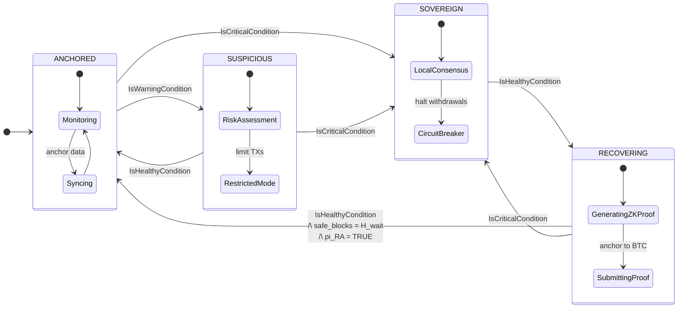
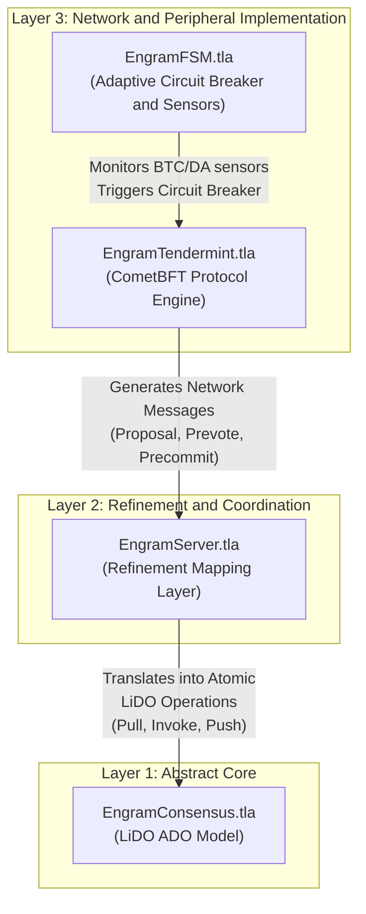
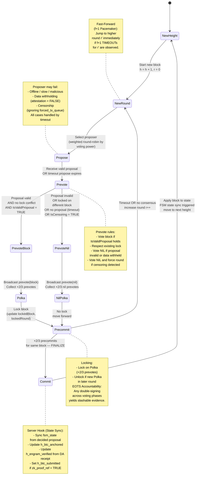
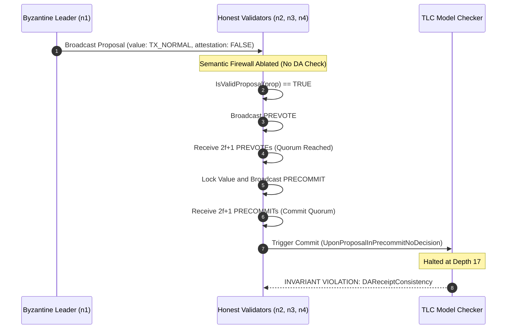

# Formal Specification and Verification of the Engram Hybrid Adaptive Consensus: FSM with Sovereign Fallback

## Table of contents
  - [Abstract](#abstract)
  - [1. Problem Statement](#1-problem-statement)
    - [1.1 Structural Liveness Risk in Modular Blockchains](#11-structural-liveness-risk-in-modular-blockchains)
    - [1.2 The Missing Dimension: Peripheral Network Health in Consensus](#12-the-missing-dimension-peripheral-network-health-in-consensus)
  - [2. Proposed Solution: Hybrid Adaptive Consensus with Sovereign Fallback](#2-proposed-solution-hybrid-adaptive-consensus-with-sovereign-fallback)
    - [2.1 Core Idea](#21-core-idea)
    - [2.2 Finite State Machine](#22-finite-state-machine)
      - [FSM States](#fsm-states)
      - [State Comparison Summary](#state-comparison-summary)
      - [State Machine Diagram](#state-machine-diagram)
    - [2.3 Key Design Properties](#23-key-design-properties)
  - [3. Methodology: Formal Verification via Refinement Mapping](#3-methodology-formal-verification-via-refinement-mapping)
    - [3.1 The Gap in Existing Verification Frameworks](#31-the-gap-in-existing-verification-frameworks)
    - [3.2 The LiDO Framework: Reducing Liveness to Safety](#32-the-lido-framework-reducing-liveness-to-safety)
      - [Mechanized Verification via Refinement Mapping](#mechanized-verification-via-refinement-mapping)
    - [3.3 Layered Specification Architecture](#33-layered-specification-architecture)
  - [4. Network Sensors: Measuring Peripheral Layer Health](#4-network-sensors-measuring-peripheral-layer-health)
    - [4.1 Bitcoin Finality Gap Sensor](#41-bitcoin-finality-gap-sensor)
      - [Bitcoin SPV Verification](#bitcoin-spv-verification)
    - [4.2 Data Availability Gap Sensor](#42-data-availability-gap-sensor)
      - [Data Availability Sampling (DAS)](#data-availability-sampling-das)
    - [4.3 P2P Health Sensor (Tri-interface Profiler)](#43-p2p-health-sensor-tri-interface-profiler)
  - [5. State Transition](#5-state-transition)
    - [5.1 State Transition Conditions](#51-state-transition-conditions)
      - [Warning Condition](#warning-condition)
      - [Critical Condition](#critical-condition)
      - [Healthy Condition](#healthy-condition)
    - [5.2 State Transition Logic](#52-state-transition-logic)
      - [Transition Definitions](#transition-definitions)
      - [Re-anchoring via ZK-Proof of Recovery](#re-anchoring-via-zk-proof-of-recovery)
      - [Hysteresis Mechanism](#hysteresis-mechanism)
  - [7. Consensus Protocol: Hybrid Adaptive Tendermint with Extended Proposal](#7-consensus-protocol-hybrid-adaptive-tendermint-with-extended-proposal)
    - [7.1 Extended Proposal Structure](#71-extended-proposal-structure)
    - [7.2 Proposal Validation](#72-proposal-validation)
    - [7.3 Consensus State Machine Diagram](#73-consensus-state-machine-diagram)
  - [8. Security and Safety Analysis](#8-security-and-safety-analysis)
    - [8.1 State Invariants](#81-state-invariants)
    - [8.2 Attack Resilience Lemmas](#82-attack-resilience-lemmas)
  - [9. Liveness Analysis and Autonomous Recovery](#9-liveness-analysis-and-autonomous-recovery)
    - [9.1 FSM Temporal Properties](#91-fsm-temporal-properties)
    - [9.2 Transaction-Level Liveness](#92-transaction-level-liveness)
  - [10. Formal Verfication stress & ablation](#10-formal-verification-stress--ablation)
    - [10.1 Proof Strategy](#101-proof-strategy)
    - [10.2 Formal Verification stress test](#102-formal-verification-stress-test)
    - [10.3 TLC Counterexample traces analysis](#103-tlc-counterexample-traces-analysis)
  - [References](#references)
  - [Future Work](#future-work)
  - [How to Run the Verification](#how-to-run-the-verification)

## Abstract

This document presents the formal specification and model-checked verification of the **Hybrid Adaptive Consensus** protocol for the Engram modular blockchain. The core research question is: **Can a blockchain that depends on external settlement (Bitcoin) and data availability (Celestia) layers maintain provable Safety and Liveness even when those layers fail?**

We answer affirmatively. The protocol introduces a Finite State Machine (FSM) that autonomously degrades security level — rather than halting — when external dependencies become unavailable. **Critically, the consensus mechanism is extended beyond classical transaction ordering: validators now reach Byzantine-fault-tolerant agreement on both the application state and the health status of the peripheral network layers, treating the FSM state as a first-class consensus variable.**

## 1. Problem Statement

### 1.1 Structural Liveness Risk in Modular Blockchains

Modular blockchain architectures achieve scalability by separating the functions of a monolithic chain into independent, specialized layers. In the Engram architecture these layers are:

- **Execution Layer**: The Engram App-Chain, running CometBFT consensus with sub-two-second block times.
- **Data Availability (DA) Layer**: Celestia, ensuring transaction data is published and retrievable before state transitions are accepted.
- **Settlement Layer**: Bitcoin, accessed via Babylon, providing thermodynamic finality through Proof-of-Work checkpointing.

This separation introduces a dependency graph: the Execution Layer requires the DA Layer to confirm data availability before finalizing blocks, and requires the Settlement Layer to anchor checkpoints for long-range attack resistance. If either dependency becomes degraded or unreachable, a naive implementation has no recourse and halts entirely.

Concrete failure scenarios include:

- Bitcoin network congestion causes checkpoint finality to fall hours behind, triggering a liveness violation in the fork-choice rule.
- A Celestia network partition causes Data Availability Sampling (DAS) to fail, making the DA receipt unavailable.
- Simultaneous loss of both the Settlement and DA layers.

In all of these scenarios, an unmodified CometBFT engine would deadlock indefinitely because its block validity rule depends on an external precondition that is no longer satisfiable.

### 1.2 The Missing Dimension: Peripheral Network Health in Consensus

**Standard Byzantine Fault-Tolerant (BFT) consensus** protocols are concerned exclusively with **agreement on transaction ordering**. A valid block is one that contains well-formed transactions signed by a correct proposer at the right round. There is no native mechanism to represent or agree upon the operational health of the infrastructure that the chain depends upon.

This creates a second gap: **even if nodes could individually detect that the Bitcoin finality gap has grown past a threshold, they would not reach a consistent, forkless view of what the system should do about it. Different nodes observing slightly different sensor readings could make different decisions, breaking consensus.**

The **Engram Hybrid Adaptive Consensus** addresses both gaps simultaneously. Each consensus proposal carries the current FSM state, a DA receipt, and a Bitcoin anchor height as first-class fields. Validators only accept proposals whose embedded FSM state is consistent with their local sensor readings. The result is **Byzantine-fault-tolerant agreement on peripheral network health**, not only on transactions.


## 2. Proposed Solution: Hybrid Adaptive Consensus with Sovereign Fallback

### 2.1 Core Idea

The protocol maintains a four-state FSM that degrades gracefully across security levels. Instead of halting when external dependencies fail, the network:

1. **Detects degradation** through deterministic local network sensors (e.g., integrated Bitcoin SPV, Celestia DAS).
2. **Proposes a local view** of the peripheral environment, embedding the leader's observed FSM state, DA receipt, and Bitcoin anchor height directly into the current block proposal.
3. **Reaches a 2/3-quorum agreement** on this external state telemetry atomically alongside the transaction payload.
4. **Applies the appropriate security policy** (circuit breaker, withdrawal lock, fork-choice rule) based on the globally agreed-upon state.
5. **Recovers autonomously** when peripheral layers are restored, re-anchoring sovereign blocks to Bitcoin via a single recursive ZK-Proof.

Critically, the consensus object is extended: a valid proposal is no longer merely a transaction batch; it is a tuple `[transactions, fsm_state, da_receipt, btc_receipt, zk_proof_ref]`. A validator will only issue a `Prevote` for a proposal if all peripheral components strictly match its own local sensor readings, effectively establishing Byzantine-fault-tolerant agreement on the health of the entire modular stack.

### 2.2 Finite State Machine

#### FSM States

The FSM governs four states:
 
- **ANCHORED**: Normal operation. Bitcoin-secured via Babylon checkpointing; DA confirmed via Celestia/Blobstream.
- **SUSPICIOUS**: Early warning. Warning conditions detected — restricts high-risk transactions and prioritizes critical operations.
- **SOVEREIGN**: Active partition. Local PoS activated; Circuit Breaker halts all cross-chain withdrawals.
- **RECOVERING**: Resolution. Connectivity restored; aggregates all Sovereign transitions into a single recursive ZK-Proof to re-anchor to Bitcoin.

#### State Comparison Summary

| State | Incident Phase | Security Basis | Withdrawals | Throughput | Finality |
|---|---|---|---|---|---|
| ANCHORED | Normal | Bitcoin + Celestia DA | Permitted | Full | ~10-60 min |
| SUSPICIOUS | Early warning | Bitcoin (degraded) | Permitted | Restricted | Moderate |
| SOVEREIGN | Active partition | Local PoS | Locked | Full | ~2 sec |
| RECOVERING | Resolution | Local PoS + pending proof | Locked | Full | ~2 sec |

#### State Machine Diagram



### 2.3 Key Design Properties

- **Graceful degradation.** Security level decreases monotonically under failure rather than the system halting. Data already written to the chain remains protected.

- **Self-aware consensus.** The FSM transition is not an out-of-band governance action; it is agreed upon within the standard Tendermint consensus pipeline. The FSM state is embedded in each proposal and validated by every prevoting node.

- **Hysteresis.** Recovery from `SOVEREIGN` back to `ANCHORED` requires a sustained healthy period of `HYSTERESIS_WAIT` consecutive blocks and a valid ZK-Proof. This prevents state oscillation ("flapping") caused by intermittent connectivity.

- **ZK-based re-anchoring.** Blocks produced in SOVEREIGN mode are secured by local PoS. When connectivity is restored, a single recursive SNARK aggregates all sovereign transitions into one proof, allowing O(1) verification. No re-execution of sovereign blocks is required.

- **Economic circuit breaker.** Cross-chain withdrawals are locked when the state is `SOVEREIGN` or `RECOVERING`, preventing fund extraction during periods when Bitcoin finality is not available to protect against reversion.


## 3. Methodology: Formal Verification via Refinement Mapping

### 3.1 The Gap in Existing Verification Frameworks

Historically, formally verifying the Liveness of Byzantine Fault-Tolerant (BFT) consensus protocols under partial synchrony has been a formidable challenge. While traditional model checkers excel at proving Safety, they fundamentally struggle with Liveness properties that require reasoning over infinite, continuous time traces. Consequently, most liveness proofs rely on informal, unmechanized arguments based on the Global Stabilization Time (GST).

This superficial approach is inadequate for the stringent security requirements of the Engram architecture. We must address three core challenges:

- **Full Lifecycle Liveness:** Engram's consensus must transition through complex Finite State Machine (FSM) states (e.g., `SOVEREIGN` to `ANCHORED`). We require mathematical guarantees that the system will never deadlock while awaiting strict preconditions (network health, ZK-Proof validity).

- **Hybrid Deadlock Freedom:** Engram runs two interacting state machines concurrently (the Tendermint consensus core and the Sovereign Fallback FSM). Verifying their integration requires a robust, compositional refinement technique.

- **Temporal Model Checking:** Standard invariant-based tools cannot automatically resolve infinite temporal properties without an abstraction that translates continuous time into finite, verifiable segments

### 3.2 The LiDO Framework: Reducing Liveness to Safety

To bridge this methodological gap, this project adopts the LiDO (Linearizable Byzantine Distributed Objects) framework ([Lefort et al., PODC 2024](https://dl.acm.org/doi/epdf/10.1145/3656423)) as the mathematical baseline. LiDO overcomes the liveness bottleneck through a paradigm shift: **reducing Liveness to Safety via Segmented Traces.** 

Instead of modeling infinite continuous time, LiDO discretizes time into finite segments of length $\Delta$ (the maximum network delay). Under partial synchrony, this guarantees that messages sent by a correct node in segment $\tau_i$ are definitively delivered by segment $\tau_{i+1}$. This mathematical trick constrains infinite temporal properties into discrete, verifiable step-by-step safety checks.

At its core, LiDO defines consensus via an Abstract Pacemaker (`round`, `rem_time`) and three atomic operations

- **Pull**: A leader election establishing an Election Quorum Certificate (`E_QC`). 
- **Invoke**: Proposing a method (transaction batch), establishing a Method Quorum Certificate (`M_QC`). 
- **Push**: Committing the method, advancing logical clocks, and establishing a Commit Quorum Certificate (`C_QC`).

#### Mechanized Verification via Refinement Mapping

A refinement mapping mathematically proves that a complex concrete system correctly implements a simpler abstract specification. If the abstract model guarantees a property $P$, the concrete implementation automatically inherits $P$.

In our architecture, `EngramServer.tla` serves as the shared-memory refinement bridge. It intercepts raw Tendermint consensus events and continuously constructs the abstract LiDO certificate tree. Through our refinement variables (`mapped_tree`, `mapped_fsm_state`, `mapped_local_times`), the TLC model checker directly verifies `AbstractConsensus!Safety` and `AbstractConsensus!Liveness`, allowing Engram to mechanically inherit LiDO's rigorous theorems for the entire hybrid protocol.


### 3.3 Layered Specification Architecture

The specification is organized into four layers following the refinement hierarchy:



- **Layer 1 — The Abstract Core (`EngramConsensus.tla`):** The mathematical LiDO specification. It defines the abstract buffer tree of quorum certificates (ADO-B), the fork-choice rule (`canElect`), the K-Deep finality rule for `ANCHORED` mode, and the maximum-stake-branch rule for `SOVEREIGN` mode. Safety and Liveness are established at this highly abstract level.

- **Layer 2 — The Refinement Bridge (`EngramServer.tla`):** The shared-memory integration layer. It utilizes four server hooks to intercept concrete Tendermint network events and atomically translate them into abstract LiDO operations:
  - `Server_InsertProposal` $\rightarrow$ **Pull** (`E_QC` creation)
  - `Server_ProposerVotes` $\rightarrow$ **Invoke** (`M_QC` creation)
  - `Server_UponProposalInPrecommitNoDecision` $\rightarrow$ **Push** (`C_QC` creation & FSM state sync)
  - `Server_UponTimeoutCert` $\rightarrow$ **Timeout** (`T_QC` creation)

- **Layer 3 — The Concrete Implementations:**
  - **`EngramTendermint.tla` (Protocol Engine)**: The customized CometBFT consensus engine managing the full Propose $\rightarrow$ Prevote $\rightarrow$ Precommit $\rightarrow$ Commit pipeline. It processes the extended proposal structure, simulates Byzantine attacks (data withholding, censorship, timeout flooding), and implements the improved $f+1$ pacemaker (UponfPlusOneTimeoutsAny).
  - **`EngramFSM.tla` (Sovereign Fallback):** The adaptive circuit breaker. It continuously computes `IsWarningCondition`, `IsCriticalCondition`, and `IsHealthyCondition` from peripheral sensor readings. It also manages the hysteresis counter (`safe_blocks`) and ZK-Proof validity flag (`reanchoring_proof_valid`).


## 4. Network Sensors: Measuring Peripheral Layer Health

The FSM requires deterministic, on-chain measurements of peripheral layer health. Three sensor categories are continuously evaluated. Sensor values are embedded in each consensus proposal and agreed upon by quorum, ensuring all correct nodes operate on a consistent view of network health.

### 4.1 Bitcoin Finality Gap Sensor

This sensor measures how far the latest Engram epoch checkpoint is from being Bitcoin-confirmed. A growing gap indicates Bitcoin congestion, or a liveness attack on the checkpointing system. Referring to the [Vigilante Checkpointing Monitor](https://docs.babylonlabs.io/guides/overview/babylon_genesis/architecture/vigilantes/monitor/), the Finality Gap Sensor formula is simplified as follows:

$$\Delta H_{\text{BTC}} = H_{\text{current}} - \min(H_{\text{submitted}},\, H_{\text{anchored}})$$

- $H_{\text{current}}$: latest Bitcoin block height observed by Engram validator nodes running an SPV light client.
- $H_{\text{submitted}}$: Bitcoin block height at the moment an Engram epoch checkpoint was broadcast.
- $H_{\text{anchored}}$: Bitcoin block height at which the checkpoint was confirmed (included in the Bitcoin chain).

The formula uses $\min(H_{\text{submitted}}, H_{\text{anchored}})$ as the baseline so that a submitted-but-unconfirmed checkpoint is counted toward the gap.

#### Bitcoin SPV Verification

The gap formula measures *delay*, but cannot detect *forged* checkpoint data. An eclipsed node receiving a fabricated `btc_receipt` from a Byzantine leader would see a plausible height value while the underlying checkpoint is invalid. To close this gap, each validator performs two off-band checks independently of the consensus pipeline, using Babylon's BTC Light Client and BTC Checkpoint modules:

1. **OP_RETURN Inclusion Check**: verify via Merkle proof that the Engram checkpoint transaction is included in the claimed Bitcoin block.
2. **Block Header Verification**: hash the block header to confirm `checkpoint_block_hash` matches the canonical chain maintained by the local SPV client.

The combined result is stored as a single boolean `is_btc_spv_failed` in local state. Unlike `is_das_failed`, this flag does not directly enter `IsWarningCondition` — because a failed SPV check already prevents `h_btc_anchored` from advancing, causing `btc_gap` to grow and trigger the warning condition naturally.

### 4.2 Data Availability Gap Sensor

This sensor measures the lag between the current Engram chain head and the last block for which a verified DA commitment receipt has been received from Celestia via Blobstream.

$$\Delta H_{\text{DA}} = H_{\text{local}} - H_{\text{verified}}$$

- $H_{\text{local}}$: current Engram-app chain block height.
- $H_{\text{verified}}$: highest Engram-app chain block height for which a valid DA commitment attestation has been received.

#### Data Availability Sampling (DAS)

Each Engram validator node, acting as a Celestia light client, performs $N = 15$ random sampling checks per block. This is sufficient to confirm data availability with probability greater than 99%.

Let $s_i \in \{\text{TRUE}, \text{FALSE}\}$ denote the outcome of the $i$-th sample:

$$\text{IsAvailable}(B) \triangleq \bigwedge_{i=1}^{N} s_i \qquad \text{Failed}(B) \triangleq \exists\, i \in \{1, \dots, N\} \text{s.t.} \neg s_i$$

The boolean `is_das_failed` is set to TRUE if any sampling check fails within the current epoch.

### 4.3 P2P Health Sensor (Tri-Interface Profiler)

Unlike the Bitcoin and DA sensors, which measure a single numeric gap, the P2P sensor must defend against Eclipse Attacks that operate simultaneously across multiple TCP/IP layers: routing table poisoning at the application layer, TCP slot exhaustion at the transport layer, and BGP hijacking at the network layer. A single peer count cannot distinguish honest long-lived peers from freshly injected Sybil nodes.

To model this without state space explosion, the specification abstracts the full attack surface into a composite predicate `IsP2PQualityHealthy` governed by six constants across two barrier groups, applied uniformly to all three protected interfaces of an Engram validator: the **Engram P2P layer**, the **Bitcoin SPV Client**, and the **Celestia Light Client**.

```tlaplus
IsP2PQualityHealthy ==
    \* Group 1 — Structural Constraints (defeat topology-based attacks)
    /\ SubnetDiversity            >= MIN_SUBNET_DIVERSITY  \* no ASN-level monopoly
    /\ Cardinality(ActiveAnchors) >= MIN_ANCHOR_PEERS      \* anchor nodes reachable
    /\ Cardinality(CleanPeers)    >= MIN_PEERS             \* sufficient honest peers
    
    \* Group 2 — Behavioral & Temporal Constraints (defeat identity-rotation and relay attacks)
    /\ peer_churn_rate            <= MAX_CHURN_RATE        \* no Dynamic Replacement attack
    /\ avg_peer_tenure            >= MIN_AVG_TENURE        \* no fresh Sybil injection
    /\ peer_latency               <= MAX_PEER_LATENCY      \* no relay node interception
```

The adversarial action `P2PAdversaryAttack` in `EngramFSM.tla` models the "weakest link" strategy: targeting any one of the three interfaces simultaneously triggers alarms across all six metrics, reflecting the cross-interface propagation of Eclipse symptoms.

| Constant | Group | Attack Defeated |
|---|---|---|
| `MIN_PEERS` | Structural | Peer slot exhaustion, basic Sybil |
| `MIN_SUBNET_DIVERSITY` | Structural | ASN-level BGP hijacking, botnet monopoly |
| `MIN_ANCHOR_PEERS` | Structural | Complete anchor isolation (triggers Critical) |
| `MAX_CHURN_RATE` | Behavioral | Dynamic Replacement, IP rotation |
| `MIN_AVG_TENURE` | Behavioral | Fresh Sybil injection detection |
| `MAX_PEER_LATENCY` | Temporal | Relay node interception, BGP detour |


## 5. State Transition 

### 5.1 State Transition Conditions

Sensors only **propose** a target state; the actual FSM state is determined by the consensus pipeline. `CalculateNextFSMState` is a pure function mapping sensor readings to a target state, and `ExecuteFSMTransition` writes the agreed state after block commit (triggered by `ServerUponProposalInPrecommitNoDecision`). A validator prevotes for a proposal only if the embedded `fsm_state` matches `CalculateNextFSMState` at its own local sensor readings.

#### Warning Condition

```tlaplus
IsWarningCondition == 
    \/ IsBTCGapSuspicious   \* T_Suspicious <= btc_gap < T_Sovereign
    \/ ~IsDAHealthy         \* da_gap >= DA_THRESHOLD \/ is_das_failed
    \/ ~IsP2PQualityHealthy \* any of the 6 structural/behavioral bounds violated
```

#### Critical Condition

```tlaplus
IsCriticalCondition == 
    \/ IsBTCGapSovereign                            \* btc_gap >= T_Sovereign
    \/ Cardinality(ActiveAnchors) = 0               \* complete anchor isolation
    \/ suspicious_duration >= MAX_SUSPICIOUS_TIME   \* escalation timeout
```

The anchor isolation clause captures total Eclipse Attack success and escalates directly to SOVEREIGN without waiting for the BTC gap threshold. The `suspicious_duration` timeout prevents the system from remaining indefinitely in SUSPICIOUS.

#### Healthy Condition

```tlaplus
IsHealthyCondition == 
    /\ ~IsBTCGapSovereign
    /\ ~IsBTCGapSuspicious
    /\ IsDAHealthy
    /\ IsP2PQualityHealthy
```

`IsP2PQualityHealthy` (Section 4.3) prevents an eclipsed node from declaring the network healthy and unilaterally triggering recovery.

### 5.2 State Transition Logic

All transitions require greater than 2/3 quorum agreement through the consensus pipeline. In the current specification, the FSM transition is driven by a **pure function** `CalculateNextFSMState` that maps current sensor readings to a target state deterministically, and an **action** `ExecuteFSMTransition` that writes the new state and updates the hysteresis counter upon block commit.

#### Transition Definitions

* **From ANCHORED:**

```tlaplus
AnchoredToSuspicious == 
    /\ state = ANCHORED 
    /\ IsWarningCondition 
    /\ ~IsCriticalCondition

AnchoredToSovereign == 
    /\ state = ANCHORED 
    /\ IsCriticalCondition
```

* **From SUSPICIOUS:**

```tlaplus
SuspiciousToAnchored == 
    /\ state = SUSPICIOUS 
    /\ IsHealthyCondition

SuspiciousToSovereign == 
    /\ state = SUSPICIOUS 
    /\ IsCriticalCondition
```

Note that `suspicious_duration` is incremented each block the system remains in `SUSPICIOUS` and reset to zero upon any state change. This counter feeds into `IsCriticalCondition` via the $\tau_{\text{max}}$ clause.

* **From SOVEREIGN:**

```tlaplus
SovereignToRecovering == 
    /\ state = SOVEREIGN 
    /\ IsHealthyCondition
```

* **From RECOVERING:**

```tlaplus
RecoveringProgress == 
    /\ state = RECOVERING 
    /\ IsHealthyCondition 
    /\ safe_blocks < HYSTERESIS_WAIT

RecoveringToAnchored == 
    /\ state = RECOVERING
    /\ IsHealthyCondition 
    /\ safe_blocks = HYSTERESIS_WAIT 
    /\ PI_RA = TRUE

RecoveringToSovereign == 
    /\ state = RECOVERING 
    /\ IsCriticalCondition
```

#### Re-anchoring via ZK-Proof of Recovery

Blocks produced in `SOVEREIGN` mode are secured only by local PoS and lack Bitcoin-anchored finality. To safely restore connectivity and return to `ANCHORED`, the system must reconcile these sovereign blocks with the Bitcoin-anchored history. 

Crucially, the objective of the re-anchoring circuit is **not** to prove the correct execution of all state transitions (Proof of Execution), which would require a massive zkVM-like arithmetization. Instead, it is designed as a **Proof of Recovery**. The circuit strictly proves that the sequence of sovereign blocks maintained continuity and adhered to the FSM recovery policies (e.g., locking withdrawals). 

This fundamental scoping minimizes the arithmetization size and constraint count, keeping the prover cost practically low while maintaining an $O(1)$ verification time and minimal proof size suitable for on-chain or off-chain DA validation.

**1. Cryptographic Assumptions**

The re-anchoring proof relies on standard cryptographic assumptions:

- **Random Oracle Model (ROM):** The cryptographic hash function (Poseidon2) is modeled as a random oracle to ensure collision resistance within the circuit.
- **Knowledge Soundness:** There exists a polynomial-time extractor such that if a prover can produce a valid proof $\pi_{RA}$, they must possess the valid underlying witness $w$.

**2. Re-anchoring Relation and Predicate**

We formally define the re-anchoring relation $\mathcal{R}_{RA}$ to separate public inputs $x$ from the private witness $w$. Rather than proving complex transaction bodies, the witness $w$ consists solely of the sequence of lightweight block headers generated during the disconnection.

Let $rt_{last}$ be the state root of the last Bitcoin-anchored block, and $rt_{new}$ be the state root of the proposed recovered block. 

```math
x = (rt_{last}, rt_{new}, n)
```

```math
w = (H_{k+1}, H_{k+2}, \dots, H_{k+n})
```

The Zero-Knowledge predicate $\Phi_{Recovery}(x, w) = 1$ is satisfied if and only if the following strict conditions hold:

**(a)**

```math
\forall i \in [n-1],\; H_{k+i+1}.\mathrm{prev\_hash} = \mathrm{Poseidon2}(H_{k+i})
```

**(b)**

```math
\forall i \in [n],\; H_{k+i}.\mathrm{fsm\_state} \in \{\texttt{SOVEREIGN},\texttt{RECOVERING}\}
```

**(c)**

```math
\forall i \in [n],\; H_{k+i}.\mathrm{withdrawal\_locked} = \mathrm{true}
```

**(d)**

```math
H_{k+1}.\mathrm{old\_state\_root}=rt_{\mathrm{last}} \land H_{k+n}.\mathrm{new\_state\_root}=rt_{\mathrm{new}}
```

**3. Circuit Guarantees**

By verifying $\Phi_{Recovery}(x, w) = 1$, the verifier $V(x, \pi_{RA})$ mathematically guarantees four core system invariants without re-executing a single transaction:

- **Condition (1) - Continuity:** Ensures the historical hash-chain is unbroken and no adversarial blocks were injected or reordered.
- **Condition (2) - Policy Adherence:** Ensures the system strictly followed the FSM transition rules, blocking any illegal jumps to `ANCHORED`.
- **Condition (3) - Economic Circuit Breaker:** Guarantees that absolutely no cross-chain withdrawals were permitted during the period of reduced security, completely mitigating double-spending extraction risks.
- **Condition (4) - State Consistency:** Cryptographically anchors the new Merkle state root to the validated unbroken header chain.

By restricting the circuit to header verification and boolean flag checks, the constraint count remains highly optimized. A single proof (utilizing Noir with an UltraPlonk/Honk backend) aggregates the entire sovereign history into a constant-size proof, yielding negligible overhead on the critical consensus path.

#### Hysteresis Mechanism

The `safe_blocks` counter prevents state oscillation. On entry into RECOVERING, the counter is reset to zero. Each block for which `IsHealthyCondition` holds increments the counter by one. The transition to ANCHORED is blocked until `safe_blocks = HYSTERESIS_WAIT`. Any deterioration that triggers `IsCriticalCondition` resets the counter and transitions to SOVEREIGN, restarting the recovery process from the beginning.


## 7. Consensus Protocol: Hybrid Adaptive Tendermint with Extended Proposal

### 7.1 Extended Proposal Structure

The base consensus engine is CometBFT (Tendermint). The key extension is the **Proposal structure**, which carries additional fields required by the hybrid model:

```text
Proposal := {
    value        : transaction batch (TX_NORMAL | TX_WITHDRAWAL),
    timestamp    : local clock at proposal time,
    round        : current consensus round,
    fsm_state    : target FSM state computed by CalculateNextFSMState,
    da_receipt   : {
                     published_block_height : Nat,   -- last DA-verified Engram-app chain height
                     attestation            : Bool   -- Blobstream confirmation
                   },
    btc_receipt  : {
                     checkpoint_block_height : Nat,   -- Bitcoin block containing Engram checkpoint 
                     checkpoint_block_hash   : Hash   -- canonical chain hash of the block contains Engram checkpoint
                   },
    zk_proof_ref : Bool  -- proof submission flag for re-anchoring
}
```

### 7.2 Proposal Validation

A validator accepts a proposal and casts a `PREVOTE` only if `IsValidProposal(proposal)` holds. This predicate enforces:

- `fsm_state` matches `CalculateNextFSMState` evaluated at the validator's local sensor readings (cross-check of agreed peripheral health).
- The DA receipt is valid and within the allowed DA gap, with round-adaptive tolerance `DATolerance(r)` (required for `ANCHORED` and `RECOVERING` states).
- `btc_receipt.checkpoint_block_height` satisfies monotonic non-decrease with round-adaptive BTC tolerance `BTCTolerance(r)`, and `VerifySPVProof(btc_receipt)` passes the canonical hash check.
- Withdrawal transactions are blocked when `fsm_state = SOVEREIGN`.
- A ZK-Proof is mandatory (`VerifyZkProof`) when `fsm_state = RECOVERING` and `safe_blocks = HYSTERESIS_WAIT`.

### 7.3 Consensus State Machine Diagram




## 8. Security and Safety Analysis

The formal correctness of the hybrid consensus protocol is guaranteed across the entire reachable state space. The network is modeled against a Byzantine adversary controlling up to $f$ nodes out of $n = 3f + 1$ total, with adversarial message scheduling and non-deterministic peripheral sensor readings.

**Theorem 8.1 (Hybrid Consensus Safety and Accountability).** *Under partial synchrony, no two honest nodes will ever decide on conflicting blocks or conflicting FSM states. Any safety violation mathematically guarantees the extraction of cryptographic double-signing evidence via EOTS.*

### 8.1 State Invariants

**Invariant S1 (Circuit Breaker Isolation).** Cross-chain withdrawals are strictly locked if and only if the protocol operates in a fallback state. This prevents fund extraction during any period when Bitcoin finality cannot guarantee the irreversibility of cross-chain transactions.

```tlaplus
CircuitBreakerSafety ==
    WithdrawLocked <=> (state \in {"SOVEREIGN", "RECOVERING"})
```

Formally specified in `EngramFSM.tla` as `CircuitBreakerSafety` and verified in both model checker configurations.

**Invariant S2 (Hysteresis Integrity).** A transition from `RECOVERING` back to `ANCHORED` is impossible without satisfying the full hysteresis wait period and providing a valid recursive ZK-Proof. This prevents premature re-anchoring during intermittent connectivity.

```tlaplus
HysteresisSafety ==
    [][ (state = "RECOVERING" /\ state' = "ANCHORED")
        => (safe_blocks = HYSTERESIS_WAIT /\ reanchoring_proof_valid) ]_fsmVars
```

Formally specified in `EngramFSM.tla` as `HysteresisSafety` and verified as a temporal safety property in `MC_ServerRefinementSafety`.

**Invariant S3 (Strict FSM Transition Safety).** Only legal adjacency transitions are permitted, preventing any illegal or out-of-order state changes.

```tlaplus
StrictFSMTransitionSafety == 
    [][ state /= state' => 
        \/ (state = "ANCHORED"   /\ state' \in {"SUSPICIOUS", "SOVEREIGN"})
        \/ (state = "SUSPICIOUS" /\ state' \in {"ANCHORED", "SOVEREIGN"})
        \/ (state = "SOVEREIGN"  /\ state' = "RECOVERING")
        \/ (state = "RECOVERING" /\ state' \in {"ANCHORED", "SOVEREIGN"})
      ]_fsmVars
```

**Invariant S4 (FSM State Consistency).** Every decided proposal must carry the same FSM state that the network is currently operating in. This closes the gap identified in Section 1.2: no node can commit a block claiming a different security posture than the one the honest majority agreed upon.

```tlaplus
FSMStateConsistency ==
    \A p \in Corr:
        decision[p] /= NilDecision => decision[p].prop.fsm_state = state
```

Formally specified in `EngramServer.tla` as `FSMStateConsistency`, part of `HybridTendermintInvariant`.

**Invariant S5 (Monotonicity Safety).** Chain heights and real time must monotonically increase or remain constant, preventing time-travel or chain rollback anomalies.

```tlaplus
MonotonicitySafety == 
    [][ /\ h_btc_current'    >= h_btc_current
        /\ h_btc_anchored'   >= h_btc_anchored
        /\ h_engram_current' >= h_engram_current
        /\ real_time'        >= real_time 
      ]_serverVars
```

### 8.2 Attack Resilience Lemmas

Beyond the state invariants, the `IsValidProposal` predicate in `EngramTendermint.tla` serves as a semantic firewall enforcing the following attack-specific lemmas at the consensus layer.

**Lemma 8.2 (Data Withholding Resistance).** A Byzantine leader publishing a block header while withholding the transaction body (`attestation = FALSE`) will have its proposal rejected by all honest validators, who cast PREVOTE NIL and force a round change.

```tlaplus
DAReceiptConsistency ==
    \A p \in Corr:
        (decision[p] /= NilDecision
         /\ decision[p].prop.fsm_state \in {"ANCHORED", "RECOVERING"})
        => decision[p].prop.da_receipt.attestation = TRUE
```

The `ByzantineDataWithholding` action in `EngramTendermint.tla` explicitly injects such malformed proposals. `DAReceiptConsistency` in `HybridTendermintInvariant` formally captures the invariant that no such proposal is ever decided.

**Lemma 8.3 (Long-Range Attack Prevention).** The fork-choice rule enforces strict monotonic settlement anchoring via `VerifySPVProof`. Any adversarial proposal attempting to revert to a prior anchor height, or carrying a forged Bitcoin branch hash, is automatically rejected.

```tlaplus
BTCConsistency ==
    \A p \in Corr:
        decision[p] /= NilDecision
        => decision[p].prop.btc_receipt.checkpoint_block_height = h_btc_anchored
```

The `ByzantineDataWithholding` action also injects a forged BTC receipt (`<<"BTC_FORK", height>>`) to verify the SPV hash check rejects it at proposal validation.

**Lemma 8.4 (Byzantine Message Flooding Mitigation).** The accepted message set from the Byzantine coalition per round and message type is deterministically bounded by $|F|$, enforced structurally by the initial message sets in `EngramTendermint.tla`.

```tlaplus
\* Pre-populated at TM_Init — exactly |Faulty| messages per round per type
FaultyPrevotes(r)   == { [type |-> "PREVOTE",   src |-> f, round |-> r, ...] : f \in Faulty }
FaultyPrecommits(r) == { [type |-> "PRECOMMIT", src |-> f, round |-> r, ...] : f \in Faulty }
FaultyTimeouts(r)   == { [type |-> "TIMEOUT",   src |-> f, round |-> r]      : f \in Faulty }
```

**Lemma 8.5 (Eclipse Attack Resilience).** The `IsP2PQualityHealthy` predicate (Section 4.3) enforces six structural and behavioral bounds as a precondition for `IsHealthyCondition`. Additionally, complete anchor isolation escalates directly to a critical condition without waiting for the BTC gap threshold.

```tlaplus
\* Recovery is gated on full P2P quality — not merely peer count
IsHealthyCondition == 
    /\ ~IsBTCGapSovereign
    /\ ~IsBTCGapSuspicious
    /\ IsDAHealthy
    /\ IsP2PQualityHealthy   \* all 6 structural/behavioral bounds must hold

\* Complete anchor isolation triggers Critical immediately
IsCriticalCondition == 
    \/ IsBTCGapSovereign
    \/ Cardinality(ActiveAnchors) = 0
    \/ suspicious_duration >= MAX_SUSPICIOUS_TIME
```

The `P2PAdversaryAttack` action in `EngramFSM.tla` has been verified to produce zero errors across both the safety and liveness state spaces. One open item remains: a dedicated TLC scenario constructing the full execution trace that shows an eclipsed proposer's fabricated `fsm_state` is deterministically rejected via `FSMStateConsistency` combined with `VerifySPVProof` (see Section 11.2).

**Lemma 8.6 (EOTS Accountability).** Any fork — a violation of `AgreementOnValue` — implies some node broadcast two conflicting messages in the same round. The `DoubleSigningEvidence` predicate detects this across all message phases, enabling EOTS-based BTC slashing without smart contract execution.

```tlaplus
DoubleSigningEvidence ==
    \E r \in Rounds, p \in AllProcs :
        \/ \E m1, m2 \in msgs_prevote[r] :
               /\ m1.src = p /\ m2.src = p /\ m1.id /= m2.id
        \/ \E m1, m2 \in msgs_precommit[r] :
               /\ m1.src = p /\ m2.src = p /\ m1.id /= m2.id
        \/ \E m1, m2 \in msgs_propose[r] :
               /\ m1.src = p /\ m2.src = p /\ m1.proposal /= m2.proposal

Accountability ==
    (~AgreementOnValue) => DoubleSigningEvidence
```

Formally specified in `EngramTendermint.tla` as `Accountability`, part of `CoreTendermintInvariant`.

## 9. Liveness Analysis and Autonomous Recovery

Modular blockchains face critical liveness risks when peripheral layers fail. Through the refinement mapping in `EngramServer.tla`, the concrete implementation mechanically inherits the abstract liveness properties of the LiDO framework.

**Theorem 9.1 (Autonomous Liveness under Degradation).** *The protocol continually processes transactions under normal conditions and autonomously degrades, recovers, and re-anchors its security posture without permanent stalling, even during external modular layer failures.*

### 9.1 FSM Temporal Properties

Theorem 9.1 is established by verifying the following temporal leads-to properties under weak fairness assumptions, using TLC's implied-temporal checking across 8 branches.

**Property L1 (Standard Consensus Liveness).** Under repeated GST conditions, honest validators always eventually commit a new block.

```tlaplus
EventualDecisionUnderGST ==
    ([]<> GSTReached) ~> (\E p \in Corr : step[p] = "DECIDED")
```

where `GSTReached` requires synchronized clocks, sufficient peers, and `state = ANCHORED`.

**Property L2 (Circuit Breaker Liveness).** When a critical condition is detected, the network must eventually reach `SOVEREIGN`. The improved $f+1$ pacemaker (`UponfPlusOneTimeoutsAny`) guarantees that lagging nodes fast-forward once $f+1$ honest nodes have timed out.

```tlaplus
CircuitBreakerLiveness ==
    IsCriticalCondition ~> (state = "SOVEREIGN" \/ ~IsCriticalCondition)
```

**Property L3 (Autonomous Recovery Initiation).** Once in `SOVEREIGN` with healthy peripheral layers, the network must eventually initiate recovery. `IsHealthyCondition` requiring `IsP2PQualityHealthy` guarantees a quorum of honest nodes is connected to agree on `SovereignToRecovering`.

```tlaplus
RecoveryAttemptLiveness ==
    (state = "SOVEREIGN" /\ IsHealthyCondition)
    ~> (state = "RECOVERING" \/ ~IsHealthyCondition)
```

**Property L4 (Complete Re-anchoring).** Once a valid ZK-Proof is available and conditions remain healthy, the system must eventually return to `ANCHORED`. Under these conditions `RecoveringToAnchored` is the only enabled FSM transition; weak fairness guarantees it fires.

```tlaplus
CompleteRecoveryLiveness ==
    (state = "RECOVERING" /\ reanchoring_proof_valid /\ IsHealthyCondition)
    ~> (state = "ANCHORED" \/ ~IsHealthyCondition \/ ~reanchoring_proof_valid)
```

**Property L5 (ZK-Proof Generation Liveness).** During recovery under healthy conditions, a valid re-anchoring proof must eventually be produced.

```tlaplus
ZKProofGenerationLiveness == 
    (state = "RECOVERING" /\ IsHealthyCondition) ~> (reanchoring_proof_valid = TRUE)
```

**Property L6 (Persistent Eclipse Resolution).** Persistent P2P anomalies must eventually resolve into either a secured or fully recovered state, preventing indefinite operation under degraded connectivity.

```tlaplus
PersistentEclipseResolutionLiveness == 
    ([]<> ~IsP2PQualityHealthy) ~> (state \in {"SOVEREIGN", "ANCHORED"})
```

### 9.2 Transaction-Level Liveness

**Property L7 (Active Censorship Resistance).** If a Byzantine leader ignores a valid transaction in `forced_tx_queue` for `MAX_IGNORE_ROUNDS` consecutive rounds, `IsCensoring` triggers a TIMEOUT broadcast, forcing a round change and eventually rotating to an honest leader.

```tlaplus
ForcedInclusionLiveness ==
    \A tx \in ValidValues :
        ([]<>(\E r \in Rounds, p \in Corr :
                  \E m \in msgs_propose[r] : m.src = p /\ m.proposal.value = tx))
        => <>(\E p \in Corr :
                  decision[p] /= NilDecision /\ decision[p].prop.value = tx)
```

Formally specified as `ForcedInclusionLiveness` in `EngramServer.tla`.

## 10. Formal Verification stress & ablation
### 10.1 Proof Strategy

The verification proceeds in two phases:

**Phase 1 — Safety.** `MC_ServerRefinementSafety` checks that the concrete `EngramServer` system — under Byzantine message scheduling, adversarial sensor readings, malicious leaders, and data withholding — never violates `AbstractConsensus!Safety`. If no counterexample is found across all reachable states, then the refinement mapping is correct for safety.

**Phase 2 — Liveness.** `MC_ServerRefinementLiveness` checks that under weak fairness conditions, `AbstractConsensus!Liveness` is satisfied. Since the concrete system refines the abstract model, Liveness at the abstract level implies Liveness at the concrete level by the refinement theorem.

The key linking invariant is `QuorumOverlap`:

$$\forall\, q_1, q_2 \in \text{ValidQuorums} : (q_1 \cap q_2) \cap \text{Corr} \neq \emptyset$$

This ensures that any two quorum decisions share at least one honest node, which is the foundation of both Agreement and Liveness in the LiDO model.

### 10.2. Formal Verification Stress Test

> Parameters $(N, f, \text{MaxRound}, \text{MaxBTCHeight}, \text{MaxEngramHeight}, \text{MaxTimestamp})$

#### Safety Verification Results

| Config | Parameters | Target Scenario | States Generated | Distinct States | Depth | Time | Violations |
| :--- | :--- | :--- | ---: | ---: | ---: | :--- | ---: |
| **C1** | 4, 1, 4, 3, 3, 10 | Base topology with adversarial injection | 324,640 | 12,481 | 10 | 49s | 0 |
| **C2** | 4, 1, 5, 4, 4, 15 | Deep consensus rounds | 1,011,237 | 35,401 | 12 | 03min 01s | 0 |
| **C3** | 7, 2, 4, 3, 3, 8 | Expanded quorum overlap | 248,222 | 9,921 | 10 | 07min 33s | 0 |


#### Liveness Verification Results

| Config | Parameters | Target Scenario | States Generated | Distinct States | Depth | Time | Violations |
| :--- | :--- | :--- | ---: | ---: | ---: | :--- | ---: |
| **C1** | 4, 1, 3, 2, 2, 6 | Base topology with adversarial injection | 79,300 | 3,313 | 8 | 43s | 0 |
| **C2** | 4, 1, 4, 3, 3, 12 | Deep consensus rounds | 406,178 | 15,041 | 11 | 05min 16s | 0 |
| **C3** | 7, 2, 3, 2, 2, 8 | Expanded quorum overlap | 111,270 | 4,465 | 8 | 03min 20s | 0 |

### 10.3. Ablation study & counterexample traces analysis

To rigorously justify the necessity of the Engram Hybrid FSM architecture, we conducted an ablation study by systematically disabling specific defensive mechanisms within the protocol's TLA+ specification. We preserved the strict mathematical invariants in the configuration files, forcing the TLC model checker to exhaustively search for attack vectors. The resulting counterexamples reveal exactly how the system fails when deprived of its core safeguards.

#### 10.3.1. Summary of Ablation Results

The table below summarizes the breadth of our formal verification stress test. By injecting omissions into the `EngramFSM` and `EngramTendermint` modules, the model checker autonomously synthesized the exact vulnerability traces that exploit the missing logic.  

<table>
  <thead>
    <tr>
      <th>Ablated Component</th>
      <th>Targeted Threat</th>
      <th>Error Depth</th>
      <th>Violated Invariant / Property</th>
    </tr>
  </thead>
  <tbody>
    <tr>
      <td>Remove Circuit Breaker</td>
      <td>Withdrawal Leakage</td>
      <td>[Điền Depth từ TLC]</td>
      <td><code>CircuitBreakerSafety</code></td>
    </tr>
    <tr>
      <td>Remove Hysteresis</td>
      <td>State Oscillation</td>
      <td>[Điền Depth từ TLC]</td>
      <td><code>HysteresisSafety</code></td>
    </tr>
    <tr>
      <td>Remove P2P Health Gate</td>
      <td>False Recovery</td>
      <td>[Điền Depth từ TLC]</td>
      <td><code>StrictFSMTransitionSafety</code></td>
    </tr>
    <tr>
      <td>Remove DA Consistency</td>
      <td>Data Withholding</td>
      <td>17</td>
      <td><code>HybridTendermintInvariant</code></td>
    </tr>
    <tr>
      <td>Remove f+1 fast-forward</td>
      <td>Liveness Deadlock</td>
      <td>[Điền Depth từ TLC]</td>
      <td><code>EventualDecisionUnderGST</code></td>
    </tr>
  </tbody>
</table>  

Evaluation Methodology Note: The TLC model checker utilized an exhaustive search to synthesize the exact attack traces that exploit the missing logic, formally proving the necessity of each architectural safeguard.*

#### 10.3.2. Deep-Dive Trace Analysis

In this section, we dissect the state-by-state execution traces generated by the TLC model checker to illustrate the exact attack vectors enabled by each ablation.

##### A. Remove Hysteresis

* **Ablated Logic:** Disabled the safe\_blocks \= HYSTERESIS\_WAIT precondition in the ExecuteFSMTransition action.  
* **TLC Metrics:** Violation found at depth \[Điền Error Depth từ TLC, ví dụ: 12\], after exploring \[Điền số States Generated, ví dụ: 45,210\] states.  
* **Counterexample Trace (State Flapping):**  
* *State \[X\] (action \= "\[Tên action\]"):* The network experiences a simulated peripheral outage, pushing the FSM to SOVEREIGN.  
* *State \[Y\] (action \= "\[Tên action\]"):* Sensors flicker back to healthy. Without hysteresis, the proposer blindly proposes an ANCHORED state block.  
* *State \[Z\] (action \= "\[Tên action\]"):* The anomaly repeats. The HysteresisSafety property is explicitly violated as the FSM continuously flaps without stabilizing.

##### B. Remove P2P Health Gate

* **Ablated Logic:** Removed the IsP2PQualityHealthy requirement from the IsHealthyCondition predicate.  
* **TLC Metrics:** Violation found at depth \[Điền Depth\], after exploring \[Điền số States\] states.  
* **Counterexample Trace (Eclipse-induced False Recovery):**  
* *State \[X\] (action \= "\[Tên action\]"):* A target validator is perfectly eclipsed by a Sybil adversary.  
* *State \[Y\] (action \= "\[Tên action\]"):* The adversary feeds the validator forged but structurally valid BTC and DA receipts.  
* *State \[Z\] (action \= "\[Tên action\]"):* The eclipsed node incorrectly evaluates IsHealthyCondition \= TRUE and attempts a false recovery, violating StrictFSMTransitionSafety.

##### C. Remove f+1 timeout fast-forward

* **Ablated Logic:** Disabled the UponfPlusOneTimeoutsAny pacemaker action, reverting to standard full-timeout waiting.  
* **TLC Metrics:** Violation found at depth \[Điền Depth\], after exploring \[Điền số States\] states.  
* **Counterexample Trace (Partial Synchrony Deadlock):**  
* *State \[X\] (action \= "\[Tên action\]"):* A network partition causes *f* honest nodes to timeout early and move to round *r+1*.  
* *State \[Y\] (action \= "\[Tên action\]"):* The remaining honest nodes stall, waiting for full local timers to expire.  
* *State \[Z\] (action \= "\[Tên action\]"):* The TLC model checker flags a violation of EventualDecisionUnderGST, proving a severe liveness delay.

##### D. Remove DA receipt consistency (With Sequence Diagram)

* **Ablated Logic:** Commented out `da_receipt.attestation = TRUE` in the `IsValidProposal` semantic firewall.  
* **TLC Metrics:** Violation found at depth **17**, after exploring **813** states (via random simulation).  
* **Counterexample Trace (Data Withholding Attack):**

*Figure X: Sequence diagram synthesized from TLC trace demonstrating a successful Data Withholding Attack when DA validation is ablated.*



* *State 2 (action = "ByzantineDataWithholding"):* A Byzantine leader constructs a block proposal withholding the transaction body from Celestia (attestation = FALSE).  
* *States 10, 14, 15 (action = "UponProposalInPropose"):* Honest validators miss the consistency check and blindly cast PREVOTE messages.  
* *State 17 (action = "UponProposalInPrevoteOrCommitAndPrevote"):* The network forms a PRECOMMIT quorum. As the protocol attempts to commit the block, the model checker halts execution, flagging a critical violation of the HybridTendermintInvariant (DAReceiptConsistency).

## References

1. Al-Bassam, M., Sonnino, A., & Buterin, V. (2019). *LazyLedger: A Distributed Data Availability Ledger with Client-Side Validation*. arXiv.  
   https://arxiv.org/abs/1905.09274

2. Buchman, E. (2016). *Tendermint: Byzantine Fault Tolerance in the Age of Blockchains* (Ph.D. Dissertation). University of Guelph.  
   https://atrium.lib.uoguelph.ca/items/6c1ad7d4-7e5c-4f7f-b3d4-3f60d4fda1f5

3. Honoré, W., Qiu, L., Kim, Y., Shin, J.-Y., Kim, J., & Shao, Z. (2024). *AdoB: Bridging Benign and Byzantine Consensus with Atomic Distributed Objects*. **Proceedings of the ACM on Programming Languages**, 8(OOPSLA1), Article 109, 1–45.  
   https://doi.org/10.1145/3649826

4. Honoré, W., Shin, J.-Y., Kim, J., & Shao, Z. (2022). *Adore: Atomic Distributed Objects with Certified Reconfiguration*. In **Proceedings of the 43rd ACM SIGPLAN International Conference on Programming Language Design and Implementation (PLDI '22)** (pp. 379–394).  
   https://doi.org/10.1145/3519939.3523444

5. Lamport, L. (2002). *Specifying Systems: The TLA+ Language and Tools for Hardware and Software Engineers*. Addison-Wesley.  
   https://lamport.azurewebsites.net/tla/book.html

6. Lefort, A., et al. (2024). *LiDO: Linearizable Byzantine Distributed Objects*. In **Proceedings of ACM PODC 2024**.  
   https://doi.org/10.1145/3656423

7. Tas, E., et al. (2022). *Babylon: Reusing Bitcoin Mining Power for Proof-of-Stake Security*. arXiv.  
   https://arxiv.org/abs/2207.08392

8. Rehman, Z., Gregory, M. A., Gondal, I., Dong, H., & Ge, M. (2024). *Eclipse Attacks in Blockchain Networks: Detection, Prevention, and Future Directions*. **IEEE Access**, 12, 125523–125553.  
   https://researchmgt.monash.edu/ws/portalfiles/portal/710203865/710203451-oa.pdf

## Future Work

### Pipelined Tendermint (Phase Merging)

The current specification verifies an unpipelined Tendermint core. A pipelined variant targeting sub-two-second block times is planned, as documented in the TODO block of `EngramTendermint.tla`:

1. Overload the PREVOTE message at round $r$ to simultaneously act as the PRECOMMIT for round $r-1$.
2. Remove the `msgs_precommit` mailbox.
3. Delegate block commit to the proposer of round $r+1$.
4. Update the Liveness refinement to require cooperation from two consecutive honest leaders (per LiDO Appendix D).

### Parametric Verification

The current results use a small-scope hypothesis (4 nodes, $f = 1$). Extending the proof to arbitrary $N$ and $f$ would require inductive invariant techniques or a parametric model checker, and is left for future work.


## How to Run the Verification

### Prerequisites

- Java JDK 11 or higher.
- `tla2tools.jar` from [TLA+ Releases](https://github.com/tlaplus/tlaplus/releases), placed at a known path.

### Safety Verification

```bash
cd docs/spec

java -cp /path/to/tla2tools.jar tlc2.TLC \
  -workers 8 \
  -config mc/server/MC_ServerRefinementSafety.cfg \
  mc/server/MC_ServerRefinementSafety.tla
```

Expected: approximately 100 minutes, 37.7M states generated, no error found.

### Liveness Verification

```bash
cd docs/spec

java -cp /path/to/tla2tools.jar tlc2.TLC \
  -workers 8 \
  -config mc/server/MC_ServerRefinementLiveness.cfg \
  mc/server/MC_ServerRefinementLiveness.tla
```

Expected: approximately 7 minutes, 1.1M states generated, no error found.

### Using VS Code

1. Install the TLA+ extension.
2. Open `MC_ServerRefinementSafety.tla` or `MC_ServerRefinementLiveness.tla`.
3. Open the Command Palette (`Cmd+Shift+P` on macOS, `Ctrl+Shift+P` on Linux/Windows).
4. Select `TLA+: Check model with TLC`.
5. Choose the corresponding `.cfg` file when prompted.